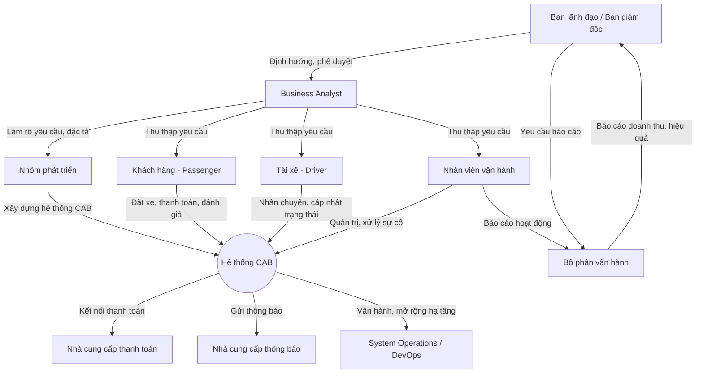
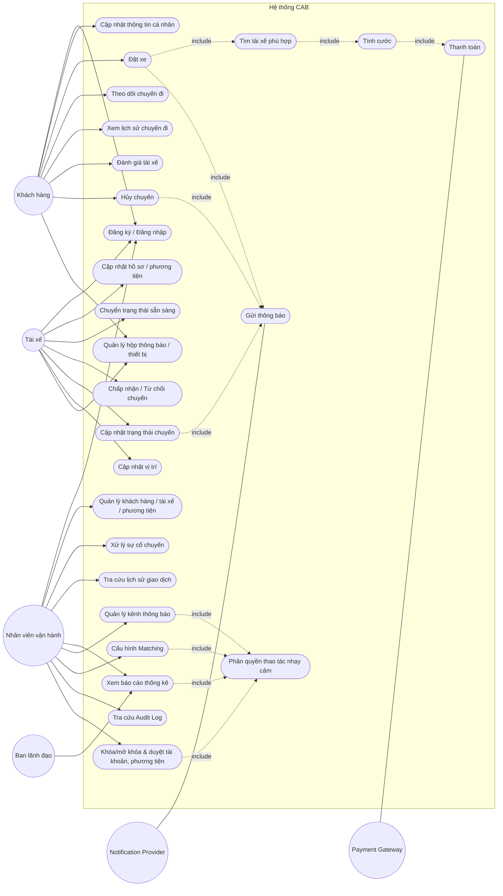
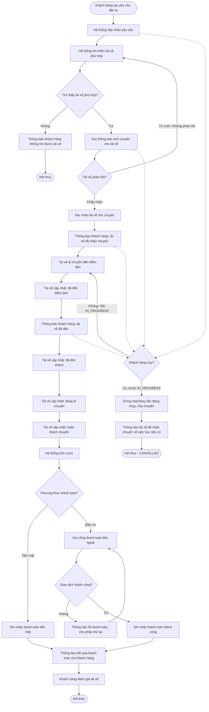
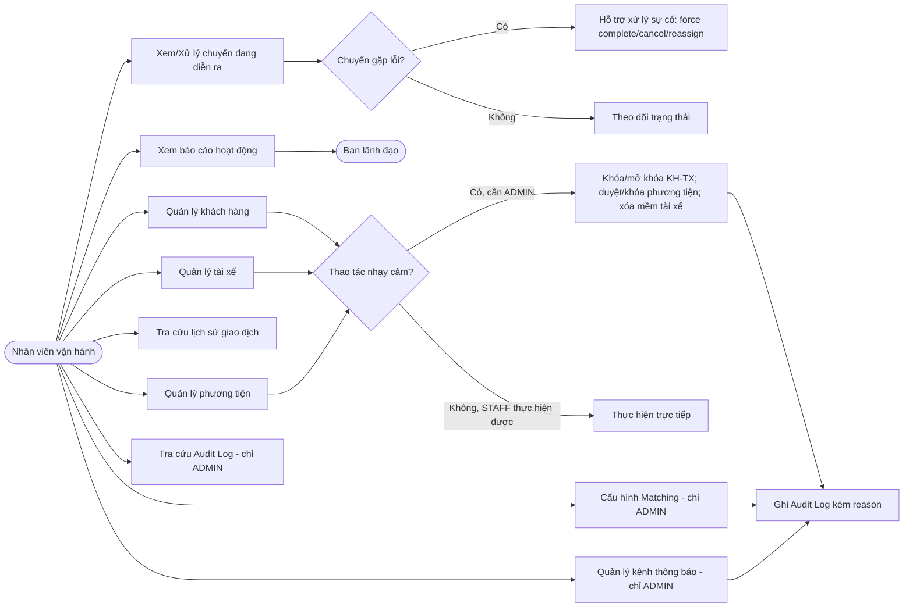
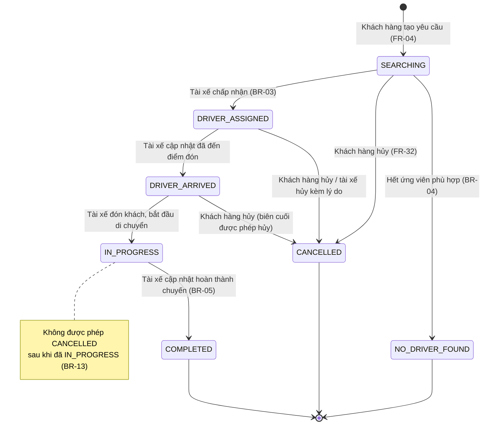
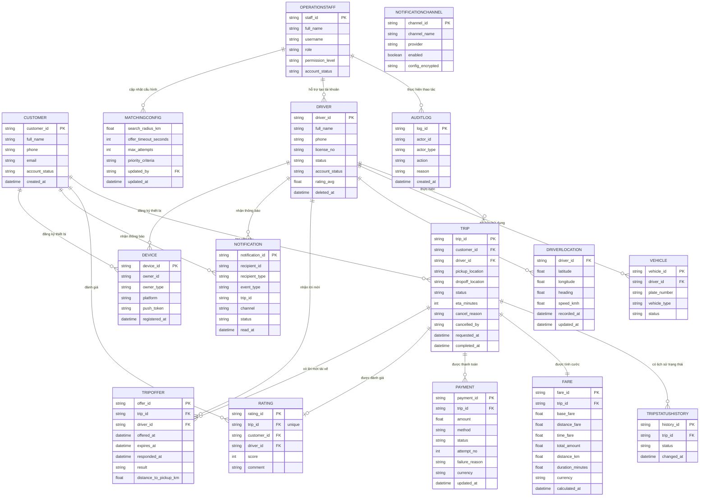

# TÀI LIỆU ĐẶC TẢ YÊU CẦU PHẦN MỀM (SRS)
## Dự án: Xây dựng Hệ thống CAB System – Nền tảng Đặt xe

**Thời gian triển khai:** 7 tuần
**Đơn vị:** Công ty ABC

---

## 1. Stakeholder (Các Bên Liên Quan)

| # | Stakeholder | Vai trò / Mô tả |
|---|---|---|
| 1 | Ban lãnh đạo / Ban giám đốc Công ty ABC | Phê duyệt định hướng, ngân sách, kỳ vọng chiến lược về nền tảng CAB |
| 2 | Khách hàng (Passenger) | Người dùng cuối, đặt xe, theo dõi chuyến đi, thanh toán, đánh giá tài xế |
| 3 | Tài xế (Driver) | Nhận và thực hiện chuyến đi, cập nhật trạng thái, cập nhật vị trí |
| 4 | Nhân viên vận hành (Operation Staff) | Quản trị khách hàng, tài xế, phương tiện, chuyến đi; xử lý sự cố |
| 5 | Bộ phận vận hành (Operations Department) | Theo dõi hoạt động, báo cáo doanh thu, tỷ lệ hoàn thành/hủy chuyến |
| 6 | Nhà cung cấp thanh toán bên ngoài (Payment Gateway Provider) | Xử lý giao dịch thanh toán điện tử, không lưu dữ liệu nhạy cảm trong hệ thống CAB |
| 7 | Nhóm phát triển (Development Team) | Thiết kế, xây dựng, triển khai hệ thống |
| 8 | Business Analyst (BA) | Làm rõ yêu cầu, phạm vi, quy trình nghiệp vụ với các bên liên quan |
| 9 | Bộ phận vận hành hệ thống/hạ tầng (System Operations/DevOps) | Đảm bảo hệ thống hoạt động ổn định, khả năng mở rộng khi tải tăng |
| 10 | Đơn vị cung cấp dịch vụ thông báo (Notification Provider) | Gửi thông báo (push/SMS/email) tới khách hàng và tài xế |

---

## 2. Stakeholder Matrix

Ma trận đánh giá mức độ **Quyền lực (Power)** và **Mức độ quan tâm/Ảnh hưởng (Interest)**:

| Stakeholder | Quyền lực (Power) | Mức độ quan tâm (Interest) | Chiến lược quản lý |
|---|---|---|---|
| Ban lãnh đạo / Ban giám đốc | Cao | Cao | Quản lý chặt chẽ (Manage Closely) |
| Khách hàng | Thấp | Cao | Thông báo thường xuyên (Keep Informed) |
| Tài xế | Thấp | Cao | Thông báo thường xuyên (Keep Informed) |
| Nhân viên vận hành | Trung bình | Cao | Quản lý chặt chẽ (Manage Closely) |
| Bộ phận vận hành (báo cáo) | Trung bình | Trung bình | Theo dõi định kỳ (Keep Satisfied) |
| Nhà cung cấp thanh toán | Trung bình | Trung bình | Theo dõi định kỳ (Keep Satisfied) |
| Nhóm phát triển | Cao | Cao | Quản lý chặt chẽ (Manage Closely) |
| Business Analyst | Cao | Cao | Quản lý chặt chẽ (Manage Closely) |
| System Operations/DevOps | Trung bình | Trung bình | Theo dõi định kỳ (Keep Satisfied) |
| Notification Provider | Thấp | Thấp | Giám sát tối thiểu (Monitor) |

---

## 3. Sơ đồ Quan hệ giữa các Stakeholder

---

## 4. Mục tiêu Kinh doanh (Business Goals)

1. **BG-01:** Xây dựng nền tảng CAB tự động hóa việc phân công tài xế, thay thế quy trình thủ công hiện tại.
2. **BG-02:** Nâng cao trải nghiệm khách hàng thông qua khả năng theo dõi chuyến đi theo thời gian thực.
3. **BG-03:** Quản lý tập trung thông tin thanh toán và cước phí, đảm bảo minh bạch và an toàn dữ liệu.
4. **BG-04:** Xây dựng hệ thống có khả năng mở rộng (scalable) để phục vụ số lượng lớn khách hàng và tài xế.
6. **BG-05:** Cung cấp công cụ báo cáo, thống kê giúp ban lãnh đạo ra quyết định (số chuyến, doanh thu, tỷ lệ hoàn thành/hủy, hiệu quả tài xế).
7. **BG-06:** Đảm bảo hệ thống hoạt động ổn định, có khả năng chịu tải cao và cô lập lỗi giữa các phân hệ (thanh toán, thông báo không làm sập toàn hệ thống).
8. **BG-07:** Đảm bảo an toàn, bảo mật dữ liệu cá nhân, dữ liệu vị trí và dữ liệu giao dịch.

---

## 5. Yêu cầu Kinh doanh (Business Requirements)

### 5.1 Yêu cầu Chức năng (Functional Requirements)

#### A. Nhóm Khách hàng (Customer)
| ID | Yêu cầu chức năng |
|---|---|
| FR-01 | Hệ thống cho phép khách hàng đăng ký tài khoản và đăng nhập |
| FR-02 | Hệ thống cho phép khách hàng cập nhật thông tin cá nhân |
| FR-03 | Hệ thống cho phép khách hàng nhập điểm đón, điểm đến và chọn loại xe |
| FR-04 | Hệ thống cho phép khách hàng gửi yêu cầu đặt xe |
| FR-05 | Hệ thống cho phép khách hàng theo dõi trạng thái chuyến đi theo thời gian thực (đang tìm tài xế, tài xế đã nhận, thời gian dự kiến đến, trạng thái hiện tại) |
| FR-06 | Hệ thống cho phép khách hàng xem lịch sử chuyến đi và số tiền đã thanh toán |
| FR-07 | Hệ thống cho phép khách hàng đánh giá tài xế sau khi hoàn thành chuyến |
| FR-08 | Hệ thống thông báo cho khách hàng khi không tìm được tài xế phù hợp |

#### B. Nhóm Tài xế (Driver)
| ID | Yêu cầu chức năng |
|---|---|
| FR-09 | Hệ thống cho phép tài xế đăng ký tài khoản, hoặc được nhân viên vận hành tạo tài khoản |
| FR-10 | Hệ thống cho phép tài xế cập nhật hồ sơ, thông tin phương tiện |
| FR-11 | Hệ thống cho phép tài xế chuyển đổi trạng thái sẵn sàng nhận chuyến |
| FR-12 | Hệ thống gửi thông báo cho tài xế khi có chuyến phù hợp, cho phép chấp nhận hoặc từ chối |
| FR-13 | Hệ thống cho phép tài xế cập nhật trạng thái chuyến (đã đến điểm đón, đã đón khách, đang di chuyển, hoàn thành) |
| FR-14 | Hệ thống lưu và cập nhật vị trí tài xế theo thời gian thực |

#### C. Nhóm Tìm và Phân công Tài xế (Matching)
| ID | Yêu cầu chức năng |
|---|---|
| FR-15 | Hệ thống tự động xác định các tài xế phù hợp dựa trên vị trí, trạng thái sẵn sàng và tiêu chí vận hành |
| FR-16 | Hệ thống ưu tiên đề xuất tài xế gần khách hàng nhất, phù hợp nhất |
| FR-17 | Hệ thống tự động tìm tài xế khác nếu tài xế được đề xuất không phản hồi hoặc từ chối, không yêu cầu khách hàng tạo lại yêu cầu |
| FR-18 | Hệ thống thông báo cho khách hàng khi không tìm được tài xế nào phù hợp |

#### D. Nhóm Thanh toán & Tính cước (Payment & Fare)
| ID | Yêu cầu chức năng |
|---|---|
| FR-19 | Hệ thống tính số tiền khách hàng phải trả dựa trên loại dịch vụ và thông tin chuyến đi |
| FR-20 | Hệ thống hỗ trợ thanh toán bằng tiền mặt và thanh toán điện tử |
| FR-21 | Hệ thống tích hợp với nhà cung cấp thanh toán bên ngoài, không lưu trực tiếp thông tin thẻ/tài khoản nhạy cảm |
| FR-22 | Hệ thống thông báo cho khách hàng khi giao dịch điện tử thất bại và cho phép xử lý lại theo chính sách |

#### E. Nhóm Thông báo (Notification)
| ID | Yêu cầu chức năng |
|---|---|
| FR-23 | Hệ thống gửi thông báo cho khách hàng khi: yêu cầu được tiếp nhận, tài xế nhận chuyến, tài xế đến điểm đón, chuyến hoàn thành, kết quả thanh toán |
| FR-24 | Hệ thống gửi thông báo cho tài xế về chuyến mới hoặc thay đổi liên quan đến chuyến đang thực hiện |
| FR-25 | Kiến trúc thông báo cho phép mở rộng thêm kênh thông báo mới trong tương lai |

#### F. Nhóm Quản trị / Vận hành (Admin/Operation)
| ID | Yêu cầu chức năng |
|---|---|
| FR-26 | Hệ thống cung cấp giao diện quản trị để quản lý khách hàng, tài xế, phương tiện, chuyến đi |
| FR-27 | Nhân viên vận hành có thể xem các chuyến đang diễn ra, kiểm tra trạng thái tài xế |
| FR-28 | Nhân viên vận hành có thể hỗ trợ xử lý các chuyến bị lỗi |
| FR-29 | Nhân viên vận hành có thể tra cứu lịch sử giao dịch |
| FR-30 | Hệ thống phân quyền chức năng quản trị, giới hạn thao tác nhạy cảm |
| FR-31 | Hệ thống cung cấp báo cáo: số lượng chuyến, doanh thu, tỷ lệ hoàn thành, tỷ lệ hủy, hiệu quả hoạt động tài xế |

#### G. Nhóm Bổ sung (rà soát từ đặc tả API — nối tiếp từ FR-32, không đánh số lại)
| ID | Yêu cầu chức năng | Endpoint liên quan |
|---|---|---|
| FR-32 | Hệ thống cho phép khách hàng hủy chuyến trước khi bắt đầu; tài xế đã nhận chuyến được thông báo | POST /trips/{id}/cancel |
| FR-33 | Hệ thống cho phép tài xế và nhân viên vận hành đăng nhập, làm mới token, đăng xuất | /drivers/auth/*, /admin/auth/* |
| FR-34 | Hệ thống cho phép tài xế xem lời mời chuyến đang chờ và chuyến hiện tại để đồng bộ khi mất kết nối | GET /drivers/{id}/offers, GET /drivers/{id}/trips/current |
| FR-35 | Hệ thống cho phép đăng ký/hủy đăng ký thiết bị nhận push | /notifications/devices |
| FR-36 | Hệ thống cho phép xem hộp thông báo, đánh dấu đã đọc | GET /notifications, PATCH /notifications/{id}/read |
| FR-37 | Hệ thống cho phép quản lý kênh thông báo (thêm, bật/tắt, đổi nhà cung cấp) | /admin/notification-channels |
| FR-38 | Hệ thống cho phép cấu hình bán kính, thời gian phản hồi, số lần thử, thứ tự tiêu chí ưu tiên của matching | /admin/matching/config |
| FR-39 | Hệ thống cho phép khóa/mở khóa khách hàng và tài xế, duyệt/khóa phương tiện, xóa (mềm) tài xế | PATCH .../status, DELETE /admin/drivers/{id} |
| FR-40 | Hệ thống cho phép tra cứu nhật ký thao tác (audit log) | GET /admin/audit-logs |

> **Ghi chú traceability:** FR-32→FR-40 đánh số nối tiếp để không làm lệch các `x-fr` đã gắn sẵn trong 6 file OpenAPI. Các endpoint tương ứng hiện đang tạm mượn FR-24, FR-25, FR-30, FR-15/16/17 trong YAML — cần cập nhật lại `x-fr` trỏ đúng về FR-32→FR-40 ở lần rà soát API kế tiếp.

## Sơ đồ use case 

### 5.2 Yêu cầu Phi Chức năng (Non-Functional Requirements)

| ID | Loại | Mô tả |
|---|---|---|
| NFR-01 | Hiệu năng (Performance) | Hệ thống phải hoạt động ổn định vào các thời điểm nhu cầu tăng cao (giờ cao điểm) |
| NFR-02 | Khả năng mở rộng (Scalability) | Các thành phần hệ thống có khả năng mở rộng (scale) độc lập khi tải tăng |
| NFR-03 | Tính sẵn sàng (Availability) | Lỗi ở chức năng thanh toán hoặc thông báo không được làm ngừng toàn bộ hệ thống đặt xe (cô lập lỗi - fault isolation) |
| NFR-04 | Khả năng triển khai (Deployability) | Chức năng mới có thể triển khai từng phần, hạn chế ảnh hưởng đến chức năng đang hoạt động |
| NFR-05 | Bảo mật - Xác thực (Authentication) | Khách hàng và tài xế phải được xác thực trước khi sử dụng các chức năng yêu cầu tài khoản |
| NFR-06 | Bảo mật - Phân quyền (Authorization) | Thao tác quản trị phải được kiểm soát quyền truy cập (role-based access control) |
| NFR-07 | Bảo mật dữ liệu (Data Security) | Thông tin cá nhân, thông tin phương tiện, dữ liệu vị trí, dữ liệu giao dịch phải được bảo vệ (mã hóa, kiểm soát truy cập) |
| NFR-08 | Tuân thủ thanh toán (Payment Compliance) | Không lưu trực tiếp thông tin nhạy cảm thẻ/tài khoản thanh toán trong hệ thống CAB (tuân thủ PCI-DSS thông qua bên thứ ba) |
| NFR-09 | Nhật ký kiểm toán (Audit Trail) | Hệ thống phải lưu vết các thao tác quan trọng phục vụ kiểm tra khi có sự cố |
| NFR-10 | Khả năng bảo trì/mở rộng (Maintainability/Extensibility) | Kiến trúc đủ linh hoạt để bổ sung dịch vụ mới, phương thức thanh toán mới, nhà cung cấp thông báo mới, hoặc thay đổi thành phần kỹ thuật mà không cần xây dựng lại toàn bộ hệ thống |
| NFR-11 | Thời gian phản hồi vị trí | Dữ liệu vị trí tài xế cần được cập nhật đủ nhanh để hỗ trợ tìm tài xế gần và dự kiến thời gian đến chính xác |
| NFR-12 | Chống thực hiện trùng (Idempotency) | Hệ thống phải chống việc thực hiện trùng khi client gọi lại (đặt xe, thanh toán) do mất mạng hoặc retry |

---
### 5.3 Yêu Cầu Hệ Thống (System Requirements - SR)

Mục này cụ thể hóa các Yêu cầu Kinh doanh (FR/NFR) thành các yêu cầu kỹ thuật mà hệ thống phải đáp ứng để triển khai được. Đây là góc nhìn kỹ thuật/kiến trúc, làm cơ sở cho đội thiết kế hệ thống (System Design).

#### 5.3.1 Yêu cầu Kiến trúc Hệ thống

| ID | Yêu cầu hệ thống | Liên quan NFR/FR | Mô tả |
|---|---|---|---|
| SR-01 | Kiến trúc theo hướng module hóa/dịch vụ (service-oriented / microservices) | NFR-02, NFR-03, NFR-04 | Tách các phân hệ Đặt xe, Matching, Thanh toán, Thông báo, Quản trị thành các service độc lập, giao tiếp qua API/message broker, để có thể scale và deploy riêng biệt |
| SR-02 | Sử dụng message queue / event-driven cho giao tiếp giữa các service | NFR-03, NFR-10 | Đảm bảo lỗi ở service Thanh toán/Thông báo không làm gián đoạn service Đặt xe (loose coupling) |
| SR-03 | API Gateway làm điểm vào duy nhất cho client (app khách hàng, app tài xế, web quản trị) | NFR-05, NFR-06 | Tập trung xác thực, giới hạn tần suất truy cập (rate limiting), định tuyến request |
| SR-04 | Cơ chế Circuit Breaker / Retry / Fallback cho các lời gọi tới dịch vụ ngoài | NFR-03, RISK-03 | Khi Payment Gateway hoặc Notification Provider bị lỗi/timeout, hệ thống không bị treo và có phương án dự phòng (VD: chuyển sang thanh toán tiền mặt) |
| SR-05 | Khả năng auto-scaling theo tải (horizontal scaling) | NFR-01, NFR-02 | Tự động tăng/giảm số lượng instance của từng service theo lưu lượng thực tế (giờ cao điểm) |

#### 5.3.2 Yêu cầu Tích hợp Hệ thống Ngoài (External Interfaces)

| ID | Hệ thống ngoài | Loại tích hợp | Mô tả |
|---|---|---|---|
| SR-06 | Payment Gateway (VD: VNPay, Momo, Stripe...) | REST API / Webhook | Hệ thống CAB gọi API để khởi tạo giao dịch, nhận kết quả qua webhook/callback; không lưu trực tiếp dữ liệu thẻ (tokenization) |
| SR-07 | SMS Gateway (VD: Twilio, ESMS, Viettel SMS) | REST API | Gửi thông báo dạng SMS cho các sự kiện quan trọng khi người dùng không mở app |
| SR-08 | Push Notification Service (Firebase Cloud Messaging / Apple Push Notification Service) | SDK / REST API | Gửi thông báo đẩy tới thiết bị di động của khách hàng và tài xế |
| SR-09 | Bản đồ & định vị (VD: Google Maps API / Mapbox) | REST API / SDK | Tính khoảng cách, thời gian di chuyển dự kiến (ETA), hiển thị bản đồ, theo dõi vị trí tài xế |
| SR-10 | Email Service (VD: SendGrid, AWS SES) | SMTP / REST API | Gửi email cho các thông báo dạng biên nhận, báo cáo, khôi phục mật khẩu |

#### 5.3.3 Yêu cầu về Nền tảng & Môi trường Triển khai

| ID | Yêu cầu | Mô tả |
|---|---|---|
| SR-11 | Ứng dụng khách hàng & tài xế | Chạy trên nền tảng di động (iOS, Android) hoặc ứng dụng web responsive (tùy phạm vi giai đoạn 1) |
| SR-12 | Cổng quản trị (Admin Portal) | Ứng dụng web, chạy trên trình duyệt hiện đại (Chrome, Edge, Safari phiên bản mới) |
| SR-13 | Môi trường triển khai | Hỗ trợ triển khai trên hạ tầng cloud (AWS/GCP/Azure) hoặc on-premise theo container hóa (Docker/Kubernetes) để đáp ứng yêu cầu mở rộng độc lập (NFR-02) |
| SR-14 | Cơ sở dữ liệu | Sử dụng hệ quản trị CSDL quan hệ (cho dữ liệu giao dịch, tài khoản) kết hợp CSDL phi quan hệ hoặc bộ nhớ đệm (cho dữ liệu vị trí thời gian thực, trạng thái chuyến) |

#### 5.3.4 Yêu cầu Giao tiếp Thời gian thực (Real-time Communication)

| ID | Yêu cầu | Liên quan FR | Mô tả |
|---|---|---|---|
| SR-15 | Kênh giao tiếp thời gian thực (WebSocket / MQTT / Server-Sent Events) | FR-05, FR-13, FR-14 | Đẩy cập nhật trạng thái chuyến đi và vị trí tài xế tới ứng dụng khách hàng/tài xế mà không cần polling liên tục |
| SR-16 | Tần suất cập nhật vị trí tài xế | FR-14, NFR-11 | Hệ thống cần định nghĩa khoảng thời gian cập nhật vị trí hợp lý (VD: 3–5 giây/lần) để cân bằng giữa độ chính xác và tải hệ thống |

#### 5.3.5 Yêu cầu Bảo mật Hệ thống (kỹ thuật hóa từ NFR-05 → NFR-09)

| ID | Yêu cầu | Mô tả |
|---|---|---|
| SR-17 | Mã hóa dữ liệu truyền tải | Toàn bộ giao tiếp giữa client - server - service ngoài phải qua HTTPS/TLS |
| SR-18 | Mã hóa dữ liệu lưu trữ (at-rest) | Dữ liệu nhạy cảm (thông tin cá nhân, vị trí, giao dịch) phải được mã hóa khi lưu trong CSDL |
| SR-19 | Cơ chế xác thực & phân quyền | Sử dụng token-based authentication (VD: JWT/OAuth2) kèm phân quyền theo vai trò (RBAC) cho từng loại tài khoản (khách hàng, tài xế, nhân viên vận hành, quản trị) |
| SR-20 | Tokenization thông tin thanh toán | Không lưu số thẻ/thông tin tài khoản thanh toán trực tiếp; chỉ lưu token do Payment Gateway trả về |
| SR-21 | Ghi nhận nhật ký hệ thống (system audit log) | Toàn bộ thao tác quan trọng (đăng nhập, thanh toán, thay đổi dữ liệu nhạy cảm) phải được ghi log tập trung, có thể tra cứu và không thể chỉnh sửa |

**Ma trận phân quyền (CUSTOMER / DRIVER / STAFF / ADMIN / EXEC × chức năng)** — tổng hợp từ trường mở rộng `x-roles` trong các file OpenAPI, làm cơ sở cho SR-19 (RBAC):

| Chức năng | CUSTOMER | DRIVER | STAFF | ADMIN | EXEC |
|---|---|---|---|---|---|
| Đăng ký / đăng nhập / refresh / logout (của chính vai trò mình) | ✔ | ✔ | ✔ | ✔ | — |
| Đặt xe, hủy chuyến, theo dõi, đánh giá tài xế | ✔ | — | — | — | — |
| Nhận/từ chối chuyến, cập nhật trạng thái chuyến, cập nhật vị trí, đổi trạng thái sẵn sàng | — | ✔ | — | — | — |
| Xem trạng thái matching của chuyến | ✔ (chủ chuyến) | — | ✔ | ✔ | — |
| Dừng matching thủ công | — | — | ✔ | ✔ | — |
| Xem/cập nhật cấu hình matching | — | — | Xem | Xem + Sửa | — |
| Khởi tạo/tra cứu thanh toán, lấy fare | ✔ (chủ chuyến) | Xem fare | Xem | Xem | — |
| Xem danh sách/chi tiết khách hàng, tài xế, phương tiện, chuyến | — | — | ✔ | ✔ | — |
| Khóa/mở khóa khách hàng, tài xế; duyệt/khóa phương tiện; xóa mềm tài xế | — | — | — | ✔ | — |
| Tạo tài khoản tài xế, cập nhật thông tin tài xế, xử lý sự cố chuyến | — | — | ✔ | ✔ | — |
| Tra cứu lịch sử giao dịch | — | — | ✔ | ✔ | — |
| Xem báo cáo thống kê | — | — | ✔ | ✔ | ✔ |
| Tra cứu Audit Log | — | — | — | ✔ | — |
| Quản lý kênh thông báo | — | — | — | ✔ | — |

#### 5.3.6 Yêu cầu về Giám sát & Vận hành (Monitoring & Operations)

| ID | Yêu cầu | Mô tả |
|---|---|---|
| SR-22 | Giám sát hệ thống (Monitoring/Alerting) | Có công cụ giám sát tình trạng hoạt động (uptime, độ trễ, tỷ lệ lỗi) của từng service, cảnh báo khi vượt ngưỡng |
| SR-23 | Sao lưu & khôi phục dữ liệu (Backup/Restore) | Có cơ chế sao lưu định kỳ và khôi phục dữ liệu khi có sự cố (chi tiết thời gian lưu trữ cần chốt cùng khách hàng - xem mục 8) |
| SR-24 | Triển khai độc lập từng phần (CI/CD, blue-green/canary deployment) | Đáp ứng NFR-04: cho phép cập nhật/triển khai từng service mà không ảnh hưởng đến các service đang hoạt động |

#### 5.3.7 Yêu cầu về Idempotency, Phiên đăng nhập & Cấu hình động

| ID | Yêu cầu | Liên quan NFR/FR | Mô tả |
|---|---|---|---|
| SR-25 | Hỗ trợ Idempotency-Key cho tạo chuyến và thanh toán | NFR-12 | Header `Idempotency-Key` cho `POST /trips`, `POST /trips/{id}/payments`, `POST /trips/{id}/cancel`; cùng key trả lại đúng kết quả của lần gọi đầu, không tạo bản ghi trùng |
| SR-26 | Xác thực webhook bằng chữ ký HMAC, xử lý idempotent theo event_id | NFR-08, SR-06 | Mở rộng SR-06: `POST /payments/webhook` xác thực `X-Signature`, sự kiện gửi lặp (cùng `event_id`) vẫn trả `200` nhưng không cập nhật trạng thái lần 2 |
| SR-27 | Quản lý phiên: access + refresh token, thu hồi khi đăng xuất hoặc khóa tài khoản | NFR-05, SR-19 | Mở rộng SR-19: refresh_token bị thu hồi (revoke) ngay khi logout hoặc tài khoản chuyển sang LOCKED |
| SR-28 | Lưu thông tin xác thực nhà cung cấp thông báo dạng mã hóa, write-only | NFR-07, FR-37 | `config` của `NotificationChannel` chỉ ghi, được mã hóa khi lưu, không bao giờ trả về qua API |
| SR-29 | Tham số matching là cấu hình động, đổi không cần deploy lại | NFR-10, FR-38 | `search_radius_km`, `offer_timeout_seconds`, `max_attempts`, `priority_criteria` đổi qua `/admin/matching/config`, áp dụng ngay cho chuyến mới |
| SR-30 | Đồng bộ trạng thái sau mất kết nối | RISK-08, FR-34 | `recorded_at` cho phép gửi bù dữ liệu vị trí; `GET /drivers/{id}/trips/current` và `GET /drivers/{id}/offers` giúp tài xế đồng bộ lại khi có kết nối trở lại |

---

## 6. Mô hình Quy trình Nghiệp vụ (Business Process Model)

### 6.1 Quy trình tổng thể: Từ đặt xe đến đánh giá sau chuyến

### 6.2 Quy trình quản trị vận hành

### 6.3 Sơ đồ trạng thái chuyến đi (Trip State Diagram)

Nguồn cho enum `TripStatus` dùng thống nhất ở cả 6 file OpenAPI (customer/driver/payment/notification/admin/matching-api).

---

## 7. Phân Tích Chức Năng Nghiệp Vụ

| Nhóm chức năng | Tác nhân chính | Mô tả nghiệp vụ | Đầu vào | Đầu ra |
|---|---|---|---|---|
| Đăng ký/Đăng nhập | Khách hàng, Tài xế | Xác thực người dùng trước khi sử dụng hệ thống | Thông tin tài khoản | Tài khoản được kích hoạt |
| Đặt xe | Khách hàng | Tạo yêu cầu chuyến đi với điểm đón/đến, loại xe | Điểm đón, điểm đến, loại xe | Yêu cầu chuyến đi (Trip Request) |
| Tìm & phân công tài xế | Hệ thống (Matching Engine) | Tìm tài xế phù hợp, xử lý từ chối/không phản hồi | Vị trí khách hàng, trạng thái tài xế | Tài xế được gán cho chuyến |
| Theo dõi chuyến đi | Khách hàng, Tài xế | Cập nhật và hiển thị trạng thái chuyến theo thời gian thực | Trạng thái chuyến | Cập nhật trạng thái hiển thị |
| Tính cước | Hệ thống | Tính số tiền dựa trên loại dịch vụ, quãng đường, thời gian | Thông tin chuyến hoàn thành | Số tiền cần thanh toán |
| Thanh toán | Khách hàng, Payment Gateway | Xử lý thanh toán tiền mặt hoặc điện tử | Số tiền, phương thức thanh toán | Trạng thái giao dịch |
| Thông báo | Hệ thống, Notification Provider | Gửi thông báo tới khách hàng/tài xế theo sự kiện | Sự kiện hệ thống | Thông báo được gửi |
| Đánh giá | Khách hàng | Đánh giá tài xế sau chuyến | Điểm đánh giá, nhận xét | Đánh giá được lưu |
| Quản trị hệ thống | Nhân viên vận hành | Quản lý dữ liệu người dùng, phương tiện, xử lý sự cố | Yêu cầu quản trị | Dữ liệu được cập nhật |
| Báo cáo thống kê | Nhân viên vận hành, Ban lãnh đạo | Tổng hợp số liệu vận hành | Dữ liệu giao dịch, chuyến đi | Báo cáo (doanh thu, tỷ lệ hoàn thành/hủy...) |
| Hủy chuyến | Khách hàng | Hủy chuyến đang SEARCHING/DRIVER_ASSIGNED/DRIVER_ARRIVED; dừng matching; báo tài xế | Trip_id, lý do hủy | Trip.status = CANCELLED, thông báo liên quan |
| Hộp thông báo / thiết bị | Khách hàng, Tài xế | Xem/đánh dấu đã đọc thông báo; đăng ký/hủy thiết bị nhận push | Thao tác trên hộp thư, push token | Trạng thái đọc, thiết bị được đăng ký |
| Cấu hình Matching | Nhân viên vận hành (ADMIN) | Thiết lập bán kính, thời gian phản hồi, số lần thử, tiêu chí ưu tiên | Tham số cấu hình | Cấu hình áp dụng cho các chuyến mới |
| Nhật ký kiểm toán (Audit Log) | Nhân viên vận hành (ADMIN) | Tra cứu nhật ký thao tác nhạy cảm theo actor/action/target/thời gian | Bộ lọc tra cứu | Danh sách log chỉ đọc, không sửa/xóa được |

---

## 8. Quy Tắc Nghiệp Vụ (Business Rules)

| ID | Quy tắc nghiệp vụ |
|---|---|
| BR-01 | Khách hàng và tài xế phải có tài khoản đã xác thực mới có thể sử dụng chức năng yêu cầu đăng nhập |
| BR-02 | Tài xế chỉ nhận được thông báo mời chuyến khi đang ở trạng thái "sẵn sàng nhận chuyến" |
| BR-03 | Nếu tài xế được đề xuất không phản hồi hoặc từ chối, hệ thống phải tự động tìm tài xế tiếp theo mà không yêu cầu khách hàng tạo lại yêu cầu. Lời mời không được phản hồi trước `expires_at` (offer_timeout_seconds) được coi như từ chối (TIMEOUT) |
| BR-04 | Nếu không tìm được tài xế phù hợp, hệ thống phải thông báo rõ ràng cho khách hàng |
| BR-05 | Số tiền cước phải được xác định dựa trên loại dịch vụ và thông tin chuyến đi sau khi chuyến hoàn thành |
| BR-06 | Thông tin nhạy cảm của thẻ/tài khoản thanh toán không được lưu trực tiếp trong hệ thống CAB |
| BR-07 | Nếu giao dịch thanh toán điện tử thất bại, hệ thống phải thông báo cho khách hàng và cho phép xử lý lại theo chính sách doanh nghiệp |
| BR-08 | Một số chức năng quản trị (thao tác nhạy cảm) chỉ được thực hiện bởi nhân viên có quyền phù hợp, không áp dụng cho nhân viên vận hành thông thường |
| BR-09 | Mọi thao tác quan trọng trên hệ thống phải được ghi log để phục vụ kiểm tra khi có sự cố |
| BR-10 | Lỗi tại phân hệ thanh toán hoặc thông báo không được làm gián đoạn chức năng đặt xe cốt lõi |
| BR-11 | Vị trí tài xế phải được cập nhật liên tục để phục vụ việc tìm tài xế gần khách hàng |
| BR-12 | Khách hàng và tài xế chỉ được xem/sửa dữ liệu của chính mình |
| BR-13 | Trạng thái chuyến chỉ chuyển theo thứ tự hợp lệ: SEARCHING → DRIVER_ASSIGNED → DRIVER_ARRIVED → IN_PROGRESS → COMPLETED; CANCELLED chỉ được phép trước IN_PROGRESS (chi tiết chính sách hủy chờ chốt) |
| BR-14 | Chỉ đánh giá được chuyến ở trạng thái COMPLETED, mỗi chuyến chỉ đánh giá một lần |
| BR-15 | Thao tác nhạy cảm (khóa, xóa, duyệt phương tiện, đổi cấu hình matching, xem audit log) chỉ ADMIN được thực hiện, bắt buộc có lý do (reason) và ghi audit log |
| BR-16 | Xóa tài xế là xóa mềm (soft delete) và bị từ chối (409) nếu tài xế đang có chuyến chưa kết thúc |
| BR-17 | Tài khoản bị khóa (account_status = LOCKED) không được đăng nhập, không đặt xe, không nhận lời mời chuyến |

## 9. Xác Định Entity (Thực Thể Dữ Liệu)

| Entity | Mô tả | Thuộc tính chính (đề xuất) |
|---|---|---|
| **Customer** | Khách hàng sử dụng dịch vụ | customer_id, full_name, phone, email, password_hash, **account_status (ACTIVE/LOCKED)**, created_at |
| **Driver** | Tài xế cung cấp dịch vụ | driver_id, full_name, phone, license_no, status (available/busy/offline), **account_status (ACTIVE/LOCKED)**, rating_avg, created_at, **deleted_at** |
| **Vehicle** | Phương tiện của tài xế | vehicle_id, driver_id (FK), plate_number, vehicle_type, brand, model, **status (PENDING_APPROVAL/ACTIVE/LOCKED)** |
| **Trip** | Chuyến đi | trip_id, customer_id (FK), driver_id (FK), pickup_location, dropoff_location, vehicle_type, status (7 giá trị: SEARCHING/DRIVER_ASSIGNED/DRIVER_ARRIVED/IN_PROGRESS/COMPLETED/CANCELLED/NO_DRIVER_FOUND), **eta_minutes**, requested_at, started_at, completed_at, **cancel_reason, cancelled_by** |
| **TripStatusHistory** | Lịch sử thay đổi trạng thái chuyến | history_id, trip_id (FK), status, changed_at |
| **DriverLocation** | Vị trí tài xế theo thời gian thực | driver_id (FK), latitude, longitude, **heading, speed_kmh, recorded_at**, updated_at |
| **Fare** | Thông tin tính cước của chuyến | fare_id, trip_id (FK), base_fare, distance_fare, **time_fare**, total_amount, **distance_km, duration_minutes, currency, calculated_at** |
| **Payment** | Giao dịch thanh toán | payment_id, trip_id (FK), amount, method (cash/e-payment), status, payment_gateway_ref, **attempt_no, failure_reason, currency**, created_at, **updated_at** |
| **Notification** | Thông báo gửi tới người dùng | notification_id, recipient_id, recipient_type (customer/driver), **event_type, trip_id**, channel, content, status (PENDING/SENT/FAILED), sent_at, **read_at** |
| **Rating** | Đánh giá tài xế sau chuyến | rating_id, trip_id (FK, **unique**), customer_id (FK), driver_id (FK), score, comment, created_at |
| **OperationStaff** | Nhân viên vận hành | staff_id, full_name, **username**, role (**STAFF/ADMIN/EXEC**), permission_level, **account_status**, created_at |
| **AuditLog** | Nhật ký thao tác quan trọng | log_id, actor_id, actor_type (customer/driver/staff/**system**), action, target_entity, target_id, **reason**, created_at |

**Entity mới bổ sung:**

| Entity | Mô tả | Thuộc tính chính (đề xuất) |
|---|---|---|
| **TripOffer** | Lời mời chuyến gửi tới tài xế trong quá trình matching, phục vụ lịch sử matching và tính acceptance_rate | offer_id, trip_id (FK), driver_id (FK), offered_at, expires_at, responded_at, result (PENDING/ACCEPTED/REJECTED/TIMEOUT), distance_to_pickup_km |
| **MatchingConfig** | Cấu hình vận hành của matching engine | search_radius_km, offer_timeout_seconds, max_attempts, priority_criteria, updated_by (FK OperationStaff), updated_at |
| **Device** | Thiết bị đăng ký nhận push notification | device_id, owner_id, owner_type (customer/driver), platform (IOS/ANDROID/WEB), push_token, registered_at |
| **NotificationChannel** | Kênh gửi thông báo (SMS, push, email...) | channel_id, channel_name, provider, enabled, config_encrypted, created_at, updated_at |
| **RefreshToken** | Phiên đăng nhập, phục vụ thu hồi khi logout/khóa tài khoản (SR-27) | token_hash, owner_id, owner_type, expires_at, revoked_at |

---

## 10. Sơ Đồ Quan Hệ Entity (ERD)

> **Ghi chú:** `RefreshToken` (token_hash, owner_id, owner_type, expires_at, revoked_at) không vẽ trong ERD vì là bảng kỹ thuật phục vụ phiên đăng nhập (SR-27), không thuộc mô hình nghiệp vụ.

---

## 11. Tiêu Chí Chấp Nhận (Acceptance Criteria)

### 11.1 Đặt xe & Tìm tài xế
- **AC-01:** Given khách hàng đã đăng nhập và nhập đầy đủ điểm đón/điểm đến/loại xe, When khách hàng bấm "Đặt xe", Then hệ thống tạo yêu cầu chuyến đi và chuyển sang trạng thái "Đang tìm tài xế".
- **AC-02:** Given hệ thống đang tìm tài xế, When tài xế đầu tiên được đề xuất từ chối hoặc không phản hồi trong thời gian quy định, Then hệ thống tự động chuyển sang đề xuất tài xế tiếp theo mà không yêu cầu khách hàng tạo lại yêu cầu.
- **AC-03:** Given không có tài xế nào phù hợp sau khi đã thử các ứng viên, When quá trình tìm kiếm kết thúc, Then hệ thống thông báo rõ ràng cho khách hàng rằng không tìm được tài xế.

### 11.2 Theo dõi chuyến đi
- **AC-04:** Given tài xế đã nhận chuyến, When trạng thái chuyến thay đổi (đến điểm đón, đón khách, di chuyển, hoàn thành), Then khách hàng thấy trạng thái cập nhật theo thời gian thực trên ứng dụng.

### 11.3 Thanh toán
- **AC-05:** Given chuyến đi đã hoàn thành, When hệ thống tính cước, Then số tiền hiển thị phải khớp với loại dịch vụ và thông tin chuyến đi đã ghi nhận.
- **AC-06:** Given khách hàng chọn thanh toán điện tử, When giao dịch thất bại, Then hệ thống thông báo lỗi cho khách hàng và cho phép thử lại theo chính sách doanh nghiệp.
- **AC-07:** Given hệ thống tích hợp với nhà cung cấp thanh toán ngoài, When giao dịch được xử lý, Then thông tin thẻ/tài khoản nhạy cảm không được lưu trực tiếp trong cơ sở dữ liệu hệ thống CAB.

### 11.4 Thông báo
- **AC-08:** Given một sự kiện xảy ra trong vòng đời chuyến đi (tiếp nhận yêu cầu, tài xế nhận chuyến, tài xế đến, hoàn thành, kết quả thanh toán), When sự kiện được kích hoạt, Then khách hàng nhận được thông báo tương ứng.
- **AC-09:** Given tài xế có chuyến mới hoặc thay đổi liên quan đến chuyến đang thực hiện, When sự kiện xảy ra, Then tài xế nhận được thông báo tương ứng.

### 11.5 Quản trị
- **AC-10:** Given nhân viên vận hành thông thường đăng nhập, When họ cố gắng thực hiện thao tác quản trị nhạy cảm, Then hệ thống từ chối thao tác do không đủ quyền.
- **AC-11:** Given ban lãnh đạo yêu cầu xem báo cáo, When truy cập màn hình báo cáo, Then hệ thống hiển thị số lượng chuyến, doanh thu, tỷ lệ hoàn thành, tỷ lệ hủy và hiệu quả tài xế trong khoảng thời gian được chọn.

### 11.6 Độ ổn định & Bảo mật
- **AC-12:** Given phân hệ thanh toán hoặc thông báo gặp sự cố, When lỗi xảy ra, Then chức năng đặt xe cốt lõi (tạo yêu cầu, tìm tài xế, theo dõi chuyến) vẫn hoạt động bình thường.
- **AC-13:** Given người dùng chưa xác thực, When họ cố truy cập chức năng yêu cầu tài khoản, Then hệ thống từ chối truy cập và yêu cầu đăng nhập.
- **AC-14:** Given một thao tác quan trọng được thực hiện trên hệ thống (thanh toán, phân quyền, chỉnh sửa dữ liệu tài xế...), When thao tác hoàn tất, Then hệ thống ghi lại nhật ký (audit log) đầy đủ thông tin tác nhân, hành động và thời gian.

### 11.7 Hủy chuyến, Bảo mật truy cập & Xử lý đồng thời
- **AC-15:** Given khách hàng hủy chuyến hợp lệ (trước IN_PROGRESS), When gọi API hủy, Then trip.status = CANCELLED và tài xế đã nhận chuyến (nếu có) nhận được thông báo.
- **AC-16:** Given chuyến đang IN_PROGRESS hoặc trạng thái chuyến chuyển sai thứ tự quy định (BR-13), When khách hàng/tài xế cố hủy hoặc chuyển trạng thái, Then hệ thống từ chối với `409 Conflict`.
- **AC-17:** Given người dùng A cố truy cập hoặc thao tác trên dữ liệu của người dùng B, When gọi API, Then hệ thống trả `403 Forbidden` (BR-12).
- **AC-18:** Given tài khoản đang ở trạng thái LOCKED, When người dùng cố đăng nhập hoặc nhận lời mời chuyến, Then hệ thống từ chối (BR-17).
- **AC-19:** Given webhook thanh toán nhận chữ ký sai hoặc sự kiện trùng lặp (cùng event_id), When xử lý webhook, Then chữ ký sai bị từ chối (`401`), sự kiện trùng không cập nhật trạng thái lần 2.
- **AC-20:** Given client gọi API tạo chuyến hoặc thanh toán 2 lần với cùng `Idempotency-Key`, When xử lý request thứ hai, Then hệ thống chỉ tạo một bản ghi duy nhất và trả lại cùng kết quả (NFR-12).
- **AC-21:** Given giao dịch thanh toán điện tử ở trạng thái FAILED, When khách hàng thử lại, Then hệ thống tạo lần thử mới (attempt_no tăng); nếu vượt chính sách số lần/thời hạn thử lại thì trả `409`.
- **AC-22:** Given cổng thanh toán bên ngoài lỗi/timeout, When khách hàng khởi tạo thanh toán điện tử, Then hệ thống trả `503` kèm `Retry-After`, và khách hàng có thể chuyển sang thanh toán tiền mặt mà không ảnh hưởng đặt xe (SR-04).
- **AC-23:** Given chuyến chưa COMPLETED hoặc đã có Rating, When khách hàng cố đánh giá, Then hệ thống từ chối với `409 Conflict` (BR-14).
- **AC-24:** Given ADMIN thay đổi cấu hình matching hoặc bật/tắt một kênh thông báo, When thao tác hoàn tất, Then thay đổi chỉ áp dụng cho chuyến mới/kênh liên quan (không ảnh hưởng chuyến đang chạy hoặc kênh khác), và được ghi audit log.

---

## 13. Rủi ro (Risks)

| ID | Rủi ro | Mô tả | Ảnh hưởng | Khả năng xảy ra | Biện pháp giảm thiểu |
|---|---|---|---|---|---|
| RISK-01 | Thời gian triển khai ngắn (7 tuần) | Phạm vi nghiệp vụ lớn (3 nhóm actor, matching, thanh toán, thông báo, báo cáo) có thể vượt quá khả năng hoàn thành trong 7 tuần | Cao | Cao | Ưu tiên hóa yêu cầu theo MoSCoW, triển khai theo từng giai đoạn (MVP trước, mở rộng sau) |
| RISK-02 | Chưa chốt quy tắc nghiệp vụ (cách tính cước, tiêu chí ưu tiên tài xế, chính sách hủy...) | Có thể dẫn tới thiết kế/code phải làm lại khi khách hàng chốt yêu cầu muộn | Cao | Cao | BA làm rõ và chốt các quy tắc còn thiếu ngay trong giai đoạn phân tích, trước khi dev bắt đầu |
| RISK-03 | Phụ thuộc vào nhà cung cấp thanh toán bên thứ ba | Nếu bên thứ ba thay đổi API, downtime, hoặc chậm phản hồi sẽ ảnh hưởng luồng thanh toán | Cao | Trung bình | Thiết kế theo hướng tách rời (adapter pattern), có cơ chế retry và fallback (cho phép thanh toán tiền mặt) |
| RISK-04 | Sai lệch trong thuật toán tìm tài xế (Matching) | Nếu logic ưu tiên/khoảng cách không chính xác có thể khiến khách hàng chờ lâu hoặc tài xế không được phân công công bằng | Trung bình | Trung bình | Viết test case riêng cho matching engine, giám sát thời gian tìm tài xế trung bình sau khi go-live |
| RISK-05 | Tải hệ thống tăng cao vào giờ cao điểm | Có thể gây nghẽn cổ chai (bottleneck) nếu kiến trúc không tách rời các phân hệ | Cao | Trung bình | Thiết kế kiến trúc microservice/tách module, có khả năng scale độc lập, load test trước khi go-live |
| RISK-06 | Lỗi bảo mật dữ liệu cá nhân / vị trí / giao dịch | Rò rỉ dữ liệu nhạy cảm gây thiệt hại uy tín và pháp lý | Cao | Thấp | Mã hóa dữ liệu, kiểm soát truy cập theo vai trò (RBAC), audit log đầy đủ |
| RISK-07 | Thông tin thẻ thanh toán bị lưu trực tiếp trong hệ thống (vi phạm PCI-DSS) | Vi phạm quy định bảo mật thanh toán nếu thiết kế sai | Cao | Thấp | Đảm bảo mọi thông tin nhạy cảm được xử lý và lưu trữ tại bên thứ ba (tokenization), không lưu trong DB của CAB |
| RISK-08 | Tài xế/khách hàng mất kết nối mạng giữa chuyến đi | Trạng thái chuyến có thể không đồng bộ, gây tranh chấp về cước phí hoặc trạng thái hoàn thành | Trung bình | Trung bình | Cần BA làm rõ chính sách xử lý mất kết nối; áp dụng cơ chế đồng bộ lại trạng thái khi có kết nối trở lại |
| RISK-09 | Thiếu nhân sự/tài nguyên phát triển trong thời gian ngắn | Không đủ người để hoàn thành tất cả các module đúng hạn | Trung bình | Trung bình | Lập kế hoạch nguồn lực rõ ràng ngay từ đầu, xác định phạm vi MVP để giảm tải |
| RISK-10 | Thay đổi yêu cầu giữa chừng (scope creep) | Khách hàng bổ sung yêu cầu mới trong quá trình phát triển làm ảnh hưởng tiến độ 7 tuần | Trung bình | Cao | Áp dụng quy trình kiểm soát thay đổi (Change Request), đánh giá tác động trước khi chấp nhận thay đổi |

---

## 14. Bảng Test Case

Bảng dưới đây liên kết Test Case với **Yêu cầu Chức năng (FR)**, **Quy tắc Nghiệp vụ (BR)** và **Tiêu chí Chấp nhận (AC)** tương ứng để đảm bảo khả năng truy vết (traceability).

| TC ID | Mô tả Test Case | FR liên quan | BR liên quan | AC liên quan | Tiền điều kiện | Bước thực hiện | Kết quả mong đợi |
|---|---|---|---|---|---|---|---|
| TC-01 | Khách hàng đặt xe thành công | FR-01, FR-03, FR-04 | BR-01 | AC-01 | Khách hàng đã đăng nhập | 1. Nhập điểm đón/đến 2. Chọn loại xe 3. Bấm "Đặt xe" | Hệ thống tạo yêu cầu chuyến, trạng thái chuyển "Đang tìm tài xế" |
| TC-02 | Tài xế từ chối chuyến, hệ thống tự tìm tài xế khác | FR-15, FR-17 | BR-03 | AC-02 | Có ít nhất 2 tài xế khả dụng gần khách hàng | 1. Tài xế A nhận thông báo mời chuyến 2. Tài xế A từ chối | Hệ thống tự động gửi mời chuyến cho tài xế B mà không yêu cầu khách hàng đặt lại |
| TC-03 | Không tìm được tài xế phù hợp | FR-15, FR-18 | BR-04 | AC-03 | Không có tài xế nào ở trạng thái sẵn sàng trong khu vực | 1. Khách hàng đặt xe 2. Hệ thống tìm kiếm hết danh sách tài xế khả dụng | Hệ thống hiển thị thông báo "Không tìm được tài xế" cho khách hàng |
| TC-04 | Tài xế chỉ nhận mời chuyến khi ở trạng thái sẵn sàng | FR-11, FR-12 | BR-02 | — | Tài xế đang ở trạng thái "offline"/"bận" | 1. Hệ thống thực hiện matching | Tài xế không nhận được thông báo mời chuyến |
| TC-05 | Cập nhật trạng thái chuyến theo thời gian thực | FR-13, FR-05 | BR-11 | AC-04 | Tài xế đã nhận chuyến | 1. Tài xế cập nhật "đã đến điểm đón" 2. Tài xế cập nhật "đã đón khách" | Khách hàng thấy trạng thái cập nhật ngay trên ứng dụng |
| TC-06 | Tính cước sau khi chuyến hoàn thành | FR-19 | BR-05 | AC-05 | Chuyến đi đã hoàn thành, có đủ dữ liệu quãng đường/thời gian | 1. Tài xế cập nhật "hoàn thành chuyến" 2. Hệ thống tính cước | Số tiền hiển thị khớp với loại dịch vụ và thông tin chuyến đi |
| TC-07 | Thanh toán điện tử thất bại | FR-20, FR-22 | BR-07 | AC-06 | Khách hàng chọn thanh toán điện tử, cổng thanh toán trả về lỗi | 1. Khách hàng xác nhận thanh toán 2. Giao dịch bị từ chối bởi cổng thanh toán | Hệ thống thông báo lỗi và cho phép khách hàng thử lại |
| TC-08 | Không lưu thông tin thẻ nhạy cảm trong hệ thống CAB | FR-21 | BR-06 | AC-07 | Khách hàng thực hiện thanh toán điện tử thành công | 1. Kiểm tra database hệ thống CAB sau giao dịch | Không có trường lưu số thẻ/CVV/thông tin tài khoản thanh toán đầy đủ trong DB CAB |
| TC-09 | Gửi thông báo đầy đủ vòng đời chuyến đi cho khách hàng | FR-23 | — | AC-08 | Chuyến đi được tạo và thực hiện đầy đủ các bước | 1. Theo dõi các mốc: tiếp nhận, tài xế nhận, tài xế đến, hoàn thành, kết quả thanh toán | Khách hàng nhận đủ 5 loại thông báo tương ứng từng mốc |
| TC-10 | Gửi thông báo cho tài xế khi có thay đổi chuyến | FR-24 | — | AC-09 | Tài xế đang thực hiện chuyến, có thay đổi (VD: khách hủy) | 1. Khách hàng hủy chuyến giữa chừng | Tài xế nhận được thông báo về thay đổi |
| TC-11 | Nhân viên vận hành thông thường không thể thực hiện thao tác nhạy cảm | FR-30 | BR-08 | AC-10 | Đăng nhập với tài khoản nhân viên vận hành, quyền hạn thấp | 1. Truy cập chức năng quản trị nhạy cảm (VD: xóa tài xế, chỉnh sửa giao dịch) | Hệ thống từ chối thao tác, hiển thị lỗi không đủ quyền |
| TC-12 | Xem báo cáo thống kê vận hành | FR-31 | — | AC-11 | Người dùng có quyền xem báo cáo (ban lãnh đạo/nhân viên có quyền) | 1. Truy cập màn hình báo cáo 2. Chọn khoảng thời gian | Hiển thị đúng số lượng chuyến, doanh thu, tỷ lệ hoàn thành, tỷ lệ hủy, hiệu quả tài xế |
| TC-13 | Hệ thống đặt xe vẫn hoạt động khi phân hệ thanh toán lỗi | NFR-03 | BR-10 | AC-12 | Mô phỏng lỗi/downtime ở service thanh toán | 1. Khách hàng đặt xe trong lúc service thanh toán bị lỗi | Chức năng đặt xe, tìm tài xế, theo dõi chuyến vẫn hoạt động bình thường |
| TC-14 | Chặn truy cập chức năng yêu cầu tài khoản khi chưa xác thực | FR-01 | — | AC-13 | Người dùng chưa đăng nhập | 1. Truy cập trực tiếp chức năng đặt xe/xem lịch sử | Hệ thống chuyển hướng về màn hình đăng nhập, từ chối truy cập |
| TC-15 | Ghi nhật ký khi thực hiện thao tác quan trọng | FR-30 | BR-09 | AC-14 | Nhân viên vận hành có quyền thực hiện thao tác nhạy cảm | 1. Thực hiện thao tác (VD: khóa tài khoản tài xế) | Hệ thống ghi lại audit log gồm tác nhân, hành động, đối tượng, thời gian |
| TC-16 | Vị trí tài xế được cập nhật liên tục | FR-14 | BR-11 | — | Tài xế đang ở trạng thái hoạt động (online) | 1. Tài xế di chuyển 2. Kiểm tra bảng DriverLocation | Vị trí tài xế được cập nhật theo khoảng thời gian định kỳ hợp lý |
| TC-17 | Khách hàng đánh giá tài xế sau chuyến | FR-07 | — | — | Chuyến đi đã hoàn thành và thanh toán xong | 1. Khách hàng chọn điểm đánh giá và nhận xét 2. Gửi đánh giá | Đánh giá được lưu và liên kết đúng với trip_id, driver_id |
| TC-18 | Tài xế được tạo tài khoản bởi nhân viên vận hành | FR-09 | — | — | Nhân viên vận hành đăng nhập với quyền quản lý tài xế | 1. Nhân viên tạo tài khoản tài xế mới với đầy đủ thông tin | Tài khoản tài xế được tạo thành công, trạng thái mặc định hợp lệ |
| TC-19 | Khách hàng hủy chuyến hợp lệ | FR-32 | BR-13 | AC-15 | Trip đang SEARCHING/DRIVER_ASSIGNED/DRIVER_ARRIVED | 1. Khách hàng gọi POST /trips/{id}/cancel | Trip.status = CANCELLED, tài xế (nếu có) nhận thông báo hủy |
| TC-20 | Hủy chuyến khi IN_PROGRESS hoặc chuyển trạng thái sai thứ tự | FR-32, FR-13 | BR-13 | AC-16 | Trip đang IN_PROGRESS | 1. Gọi API hủy hoặc PATCH status sai thứ tự | 409 Conflict |
| TC-21 | Người dùng A truy cập/thao tác dữ liệu của người dùng B | FR-02, FR-10 | BR-12 | AC-17 | Customer/Driver A đã đăng nhập, tài nguyên thuộc B | 1. A gọi API trên resource của B | 403 Forbidden |
| TC-22 | Tài khoản LOCKED không đăng nhập/không nhận lời mời | FR-01, FR-09, FR-12 | BR-17 | AC-18 | account_status = LOCKED | 1. Đăng nhập hoặc chờ nhận lời mời chuyến | Từ chối đăng nhập (403); không nhận lời mời |
| TC-23 | Webhook chữ ký sai bị từ chối; sự kiện trùng không cập nhật 2 lần | FR-21, FR-22 | BR-06, BR-07 | AC-19 | Payment đang PENDING | 1. Gửi webhook với X-Signature sai 2. Gửi lại webhook cùng event_id đã xử lý | 401 Unauthorized cho chữ ký sai; 200 OK nhưng không cập nhật lần 2 cho sự kiện trùng |
| TC-24 | Gọi tạo chuyến/thanh toán 2 lần cùng Idempotency-Key | FR-04, FR-20 | NFR-12 | AC-20 | Khách hàng đã đăng nhập | 1. Gọi API kèm Idempotency-Key K 2. Gọi lại cùng key K | Chỉ 1 bản ghi được tạo, trả cùng kết quả |
| TC-25 | Thanh toán thất bại → thử lại; vượt chính sách bị từ chối | FR-22 | BR-07 | AC-21 | Payment.status = FAILED | 1. POST /payments/{id}/retry nhiều lần | Tạo attempt_no mới cho các lần trong chính sách; 409 khi vượt giới hạn |
| TC-26 | Cổng thanh toán lỗi → 503, khách chuyển sang tiền mặt được | FR-20, FR-21 | BR-10 | AC-22 | Payment Gateway giả lập down | 1. POST /trips/{id}/payments (e_payment) trong lúc gateway lỗi 2. Đổi sang cash | 503 kèm Retry-After; đặt xe không bị ảnh hưởng; thanh toán cash thành công |
| TC-27 | Đánh giá chuyến chưa hoàn thành hoặc đánh giá lần hai | FR-07 | BR-14 | AC-23 | Trip chưa COMPLETED hoặc đã có Rating | 1. POST /trips/{id}/ratings | 409 Conflict |
| TC-28 | Đổi cấu hình matching chỉ áp dụng chuyến mới, có audit log | FR-38 | BR-15 | AC-24 | ADMIN đã đăng nhập | 1. PUT /admin/matching/config 2. Kiểm tra chuyến đang chạy và chuyến mới | Chuyến đang chạy không đổi; chuyến mới theo cấu hình mới; có audit log |
| TC-29 | Tắt một kênh thông báo không ảnh hưởng chức năng khác | FR-37 | BR-15 | AC-24 | Kênh SMS đang gặp sự cố | 1. PATCH /admin/notification-channels/{id} enabled=false | Kênh SMS tắt; push/email vẫn hoạt động bình thường |
| TC-30 | Đăng ký/hủy push token; gửi bù vị trí sau mất kết nối | FR-35, FR-34 | RISK-08 | — | Người dùng đã đăng nhập; tài xế vừa có kết nối lại | 1. POST/DELETE /notifications/devices 2. POST /drivers/{id}/location với recorded_at cũ hơn hiện tại | Thiết bị được đăng ký/hủy đúng; vị trí gửi bù được đồng bộ, bản ghi cũ hơn không ghi đè bản mới hơn |

> **Ghi chú:** bảng trên chỉ tóm tắt 1 test case đại diện cho mỗi FR/AC mới nhằm giữ traceability ở mức SRS. Bộ test case đầy đủ theo 5 đặc tính (positive/negative/boundary/null/invalid format), khoảng 20 test case cho mỗi trong 21 Test Scenario của hệ thống, được trình bày chi tiết tại `Test_Cases_CAB_System.md` (và bảng tính `Mẫu_Test.xlsx`).
