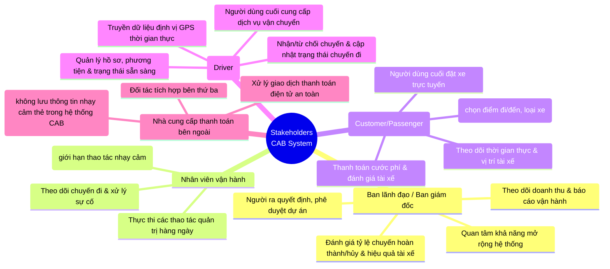

# TÀI LIỆU ĐẶC TẢ YÊU CẦU PHẦN MỀM (SRS)
## HỆ THỐNG ĐẶT XE TRỰC TUYẾN - CAB SYSTEM

---

## 1. Giới thiệu
### 1.1 Mục đích
Tài liệu này mô tả chi tiết các yêu cầu chức năng và phi chức năng cho nền tảng đặt xe trực tuyến (**CAB System**) của Công ty ABC, phục vụ cho đội ngũ phát triển, kiểm thử và ban quản lý dự án.

### 1.2 Phạm vi hệ thống
Hệ thống cung cấp giải pháp kết nối giữa khách hàng có nhu cầu di chuyển và tài xế, đồng thời cung cấp công cụ quản trị toàn diện cho nhân viên vận hành. Hệ thống hỗ trợ quy trình khép kín từ đặt xe, điều phối tự động, thực hiện chuyến đi, thanh toán, đến đánh giá và báo cáo.

---

## 2. Mô tả tổng quan
### 2.1 Các tác nhân (Actors)
* **Khách hàng:** Người sử dụng dịch vụ đặt xe, theo dõi chuyến đi, thanh toán và đánh giá.
* **Tài xế:** Người cung cấp dịch vụ vận chuyển, nhận chuyến, cập nhật trạng thái và vị trí GPS.
* **Nhân viên vận hành (Admin):** Quản lý tài khoản, theo dõi hệ thống, xử lý sự cố và xem báo cáo.
###2.2 Sơ đồ Statkhoder matrix
```mermaid
quadrantChart
    title Biểu đồ Phân tích Stakeholder (Power/Interest Grid)
    x-axis "Mức độ quan tâm thấp" --> "Mức độ quan tâm cao"
    y-axis "Mức độ ảnh hưởng thấp" --> "Mức độ ảnh hưởng cao"
    quadrant-1 "Giữ thông tin (Keep Informed)"
    quadrant-2 "Quản lý chặt chẽ (Manage Closely)"
    quadrant-3 "Giám sát (Monitor)"
    quadrant-4 "Giữ sự hài lòng (Keep Satisfied)"
    
    Ban lãnh đạo / Ban giám đốc: [0.85, 0.85]
    Nhân viên vận hành: [0.80, 0.55]
    Khách hàng (Customer / Passenger): [0.90, 0.25]
    Tài xế (Driver): [0.85, 0.20]
    Nhà cung cấp thanh toán: [0.20, 0.15]
```
### 2.2 Sơ đồ tổng quan hệ thống (Use Case / Context Diagram)
Dưới đây là sơ đồ Mermaid thể hiện tương tác giữa các tác nhân và hệ thống CAB:


2.3

