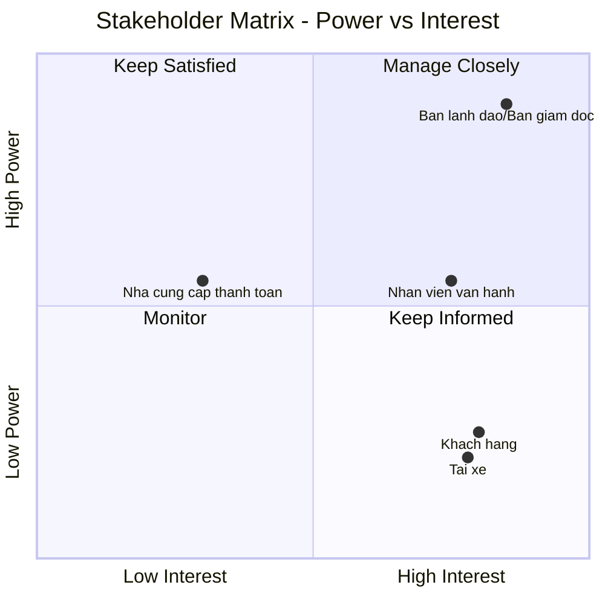
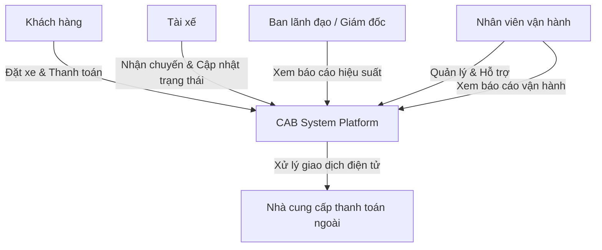
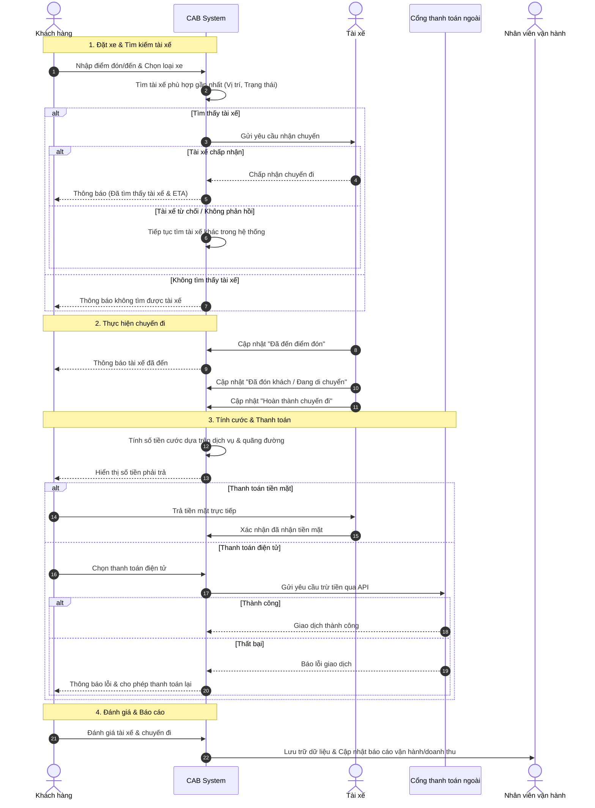

Dưới đây là tài liệu phân tích hệ thống **CAB System (Nền tảng đặt xe)** được trình bày hoàn toàn bằng định dạng Markdown của GitHub, bao gồm sơ đồ Stakeholder Matrix, sơ đồ quan hệ Stakeholder, Mục tiêu kinh doanh (Business Goals), Yêu cầu kinh doanh (Business Requirements) và Mô hình quy trình nghiệp vụ được vẽ bằng mã **Mermaid**.

---

# BÁO CÁO PHÂN TÍCH HỆ THỐNG: CAB SYSTEM

## 1. Stakeholder Matrix (Power – Interest Grid)

| Stakeholder | Power (Quyền lực/Ảnh hưởng) | Interest (Mức độ quan tâm) | Vai trò chính |
|---|---|---|---|
| Ban lãnh đạo / Ban giám đốc | Cao | Cao |  Ra quyết định, phê duyệt dự án, theo dõi doanh thu & hiệu quả vận hành |
| Nhân viên vận hành | Trung bình | Cao |  Thực thi thao tác quản trị hàng ngày, xử lý sự cố |
| Khách hàng (Customer/Passenger) | Thấp | Cao | Người dùng cuối đặt xe, trải nghiệm dịch vụ |
| Tài xế (Driver) | Thấp | Cao | Người dùng cuối cung cấp dịch vụ vận chuyển |
| Nhà cung cấp thanh toán bên ngoài | Trung bình | Thấp | Đối tác xử lý giao dịch thanh toán điện tử |

### Biểu đồ ma trận (Mermaid Quadrant Chart)




## 3. Sơ đồ Quan hệ giữa các Stakeholder (Stakeholder Relationship Diagram)

Sơ đồ Mermaid thể hiện mối quan hệ và sự tương tác giữa các bên liên quan trong hệ sinh thái CAB System:



---

## 4. Mục tiêu Kinh doanh (Business Goals)

Dựa trên yêu cầu của Công ty ABC, các mục tiêu chiến lược của hệ thống CAB System gồm:

1. **Mở rộng quy mô phục vụ:** Xây dựng nền tảng mới có khả năng phục vụ số lượng lớn khách hàng và tài xế đồng thời, khắc phục tình trạng phân công thủ công hiện tại.


2. **Tối ưu hóa quy trình vận hành:** Tự động hóa khâu tìm kiếm và phân phối tài xế dựa trên vị trí, trạng thái sẵn sàng, giảm thiểu can thiệp thủ công của nhân viên.


3. **Minh bạch hóa trải nghiệm người dùng:** Cho phép khách hàng theo dõi thời gian thực trạng thái chuyến đi, định vị tài xế, xem lịch sử và đánh giá minh bạch.


4. **Đảm bảo an toàn thanh toán:** Tích hợp cổng thanh toán bên ngoài để xử lý giao dịch điện tử và tiền mặt linh hoạt mà không lưu trữ thông tin thẻ nhạy cảm.


5. **Kiến trúc linh hoạt, dễ mở rộng:** Hỗ trợ mở rộng độc lập các thành phần (thanh toán, thông báo, dịch vụ mới) khi tải tăng cao hoặc khi thay đổi nghiệp vụ trong tương lai.


## 5. Yêu cầu Kinh doanh (Business Requirements)

### 5.1. Yêu cầu Chức năng (Functional Requirements)

* **Quản lý tài khoản & Xác thực:** Hỗ trợ đăng ký, đăng nhập, phân quyền cho Khách hàng, Tài xế và Nhân viên vận hành.


* **Đặt xe & Tìm tài xế:** Khách hàng nhập điểm đi/đến, chọn loại xe; hệ thống tự động thuật toán tìm tài xế gần nhất, có cơ chế chuyển tiếp nếu tài xế từ chối/không phản hồi.


* **Quản lý chuyến đi:** Tài xế cập nhật các mốc trạng thái (đến điểm đón, đón khách, đang di chuyển, hoàn thành); lưu vết vị trí tài xế.


* **Tính cước & Thanh toán:** Tự động tính cước dựa trên loại dịch vụ và thông tin chuyến đi; hỗ trợ tiền mặt và thanh toán điện tử qua bên thứ ba.


* **Hệ thống thông báo:** Gửi thông báo đa kênh (trạng thái đặt xe, tài xế đến, hoàn thành, kết quả thanh toán) cho cả khách hàng và tài xế.


* **Quản trị & Báo cáo:** Giao diện cho nhân viên vận hành quản lý dữ liệu và xử lý sự cố; cung cấp báo cáo doanh thu, tỷ lệ hoàn thành/hủy chuyến cho ban lãnh đạo.


### 5.2. Yêu cầu Phi Chức năng (Non-Functional Requirements)

* **Hiệu năng & Khả năng mở rộng:** Hệ thống ổn định vào giờ cao điểm; các thành phần có thể mở rộng độc lập khi tải tăng.


* **Bảo mật:** Xác thực chặt chẽ, kiểm soát quyền truy cập trang quản trị; bảo vệ dữ liệu cá nhân, vị trí, giao dịch và lưu vết (audit log) các thao tác quan trọng.


* **Tính linh hoạt kiến trúc:** Cho phép triển khai từng phần tính năng mới mà không làm gián đoạn các dịch vụ đang hoạt động.


---

## 6. Mô hình Quy trình Nghiệp vụ (Business Process Model)

Sơ đồ Mermaid dưới đây mô tả toàn bộ vòng đời quy trình nghiệp vụ của một chuyến đi trên hệ thống CAB System (từ lúc đặt xe đến khi đánh giá):


### 7 Phân tích chức năng nghiệp vụ

# Phân Tích Chức Năng Nghiệp Vụ — Hệ Thống Gọi Xe Công Nghệ (CAB)

> Tài liệu phân rã các chức năng nghiệp vụ dựa trên Sequence Diagram hệ thống CAB.

---

## Tổng quan

Hệ thống được phân rã thành **4 module nghiệp vụ chính**:

1. Đặt xe & Điều phối tài xế
2. Quản lý hành trình (Trip Lifecycle)
3. Tính cước & Thanh toán
4. Đánh giá & Báo cáo vận hành

---

## 1. Module Đặt Xe & Điều Phối Tài Xế (Booking & Dispatch)

| Mã | Chức năng | Mô tả |
|----|-----------|-------|
| F1.1 | Đặt chuyến đi | Khách hàng nhập điểm đón, điểm đến, chọn loại dịch vụ xe (car/bike/premium...) |
| F1.2 | Tìm kiếm tài xế phù hợp | Lọc tài xế gần nhất dựa trên vị trí GPS và trạng thái (rảnh/bận) |
| F1.3 | Gửi yêu cầu chuyến đi tới tài xế | Push notification yêu cầu nhận chuyến |
| F1.4 | Xử lý phản hồi tài xế | Ghi nhận Chấp nhận / Từ chối / Timeout không phản hồi |
| F1.5 | Tìm tài xế thay thế | Tự động chuyển yêu cầu sang tài xế tiếp theo nếu bị từ chối |
| F1.6 | Thông báo kết quả đặt xe | Báo tìm thấy tài xế kèm ETA, hoặc báo không tìm được tài xế |

**Đối tượng nghiệp vụ liên quan:** Driver Pool, Trip Request, Location Tracking, Vehicle/Service Type.

---

## 2. Module Quản Lý Hành Trình (Trip Execution)

| Mã | Chức năng | Mô tả |
|----|-----------|-------|
| F2.1 | Cập nhật "Tài xế đã đến điểm đón" | Tài xế xác nhận đã tới vị trí đón khách |
| F2.2 | Thông báo real-time cho khách | Đồng bộ trạng thái chuyến đi tới khách hàng |
| F2.3 | Cập nhật "Đã đón khách / Đang di chuyển" | Chuyển trạng thái chuyến đi |
| F2.4 | Cập nhật "Hoàn thành chuyến đi" | Kết thúc hành trình |

**Ghi chú nghiệp vụ:** Đây là một **State Machine** của chuyến đi:

```
Requested → Accepted → Driver Arrived → In Progress → Completed
```

> ⚠️ Sơ đồ hiện chưa mô tả trạng thái **Cancelled** (hủy chuyến) — cần bổ sung khi phân tích đầy đủ.

---

## 3. Module Tính Cước & Thanh Toán (Fare & Payment)

| Mã | Chức năng | Mô tả |
|----|-----------|-------|
| F3.1 | Tính cước phí | Dựa trên loại dịch vụ, quãng đường |
| F3.2 | Hiển thị số tiền cần thanh toán | Thông báo cho khách hàng |
| F3.3 | Thanh toán tiền mặt | Khách trả trực tiếp → Tài xế xác nhận nhận tiền vào hệ thống |
| F3.4 | Thanh toán điện tử | Gọi API cổng thanh toán ngoài → xử lý kết quả Thành công/Thất bại |
| F3.4.1 | Xử lý giao dịch thất bại | Báo lỗi và cho phép khách thanh toán lại (retry) |

**Đối tượng nghiệp vụ liên quan:** Fare Engine, Payment Gateway Integration, Transaction Log.

> ⚠️ **Khoảng trống nghiệp vụ:** chưa có cơ chế hoàn tiền (refund), xử lý thanh toán thất bại nhiều lần, hoặc đối soát (reconciliation) với cổng thanh toán.

---

## 4. Module Đánh Giá & Báo Cáo Vận Hành (Rating & Reporting)

| Mã | Chức năng | Mô tả |
|----|-----------|-------|
| F4.1 | Đánh giá tài xế/chuyến đi | Khách hàng chấm điểm, nhận xét |
| F4.2 | Lưu trữ dữ liệu chuyến đi | Ghi nhận toàn bộ vòng đời chuyến đi |
| F4.3 | Cập nhật báo cáo vận hành/doanh thu | Tổng hợp dữ liệu phục vụ nhân viên vận hành |

---
###8. Quy Tắc Nghiệp Vụ (Business Rules) — Hệ Thống Gọi Xe Công Nghệ (CAB)

    # Quy Tắc Nghiệp Vụ (Business Rules) — Hệ Thống Gọi Xe Công Nghệ (CAB)

> Tài liệu tổng hợp các quy tắc nghiệp vụ rút ra từ Sequence Diagram hệ thống CAB, tổ chức theo 4 module chức năng.

---

## 1. Quy Tắc — Đặt Xe & Điều Phối Tài Xế

| Mã | Quy tắc |
|----|---------|
| BR1.1 | Khách hàng phải nhập đầy đủ **điểm đón, điểm đến và loại dịch vụ xe** trước khi hệ thống thực hiện tìm tài xế. |
| BR1.2 | Hệ thống chỉ tìm tài xế đang ở trạng thái **"rảnh" (available)** và **gần vị trí đón nhất** theo bán kính/khoảng cách quy định. |
| BR1.3 | Yêu cầu chuyến đi chỉ được gửi cho **một tài xế tại một thời điểm** (không gửi đồng loạt broadcast), theo thứ tự ưu tiên gần nhất. |
| BR1.4 | Nếu tài xế **từ chối** hoặc **không phản hồi trong thời gian timeout quy định**, hệ thống tự động chuyển yêu cầu sang tài xế kế tiếp trong danh sách. |
| BR1.5 | Nếu **không còn tài xế phù hợp** nào trong hệ thống, phải thông báo cho khách hàng biết không tìm được tài xế — không được để khách chờ vô thời hạn. |
| BR1.6 | Khi tài xế **chấp nhận chuyến**, hệ thống phải cập nhật trạng thái tài xế thành **"đang bận"** để tránh bị gán thêm chuyến khác. |
| BR1.7 | Khách hàng chỉ nhận được thông báo **ETA** sau khi có tài xế xác nhận chấp nhận chuyến. |

---

## 2. Quy Tắc — Quản Lý Hành Trình (Trip Lifecycle)

| Mã | Quy tắc |
|----|---------|
| BR2.1 | Trạng thái chuyến đi phải tuân theo đúng trình tự tuyến tính, **không được nhảy cóc bước**: `Accepted → Driver Arrived → In Progress → Completed`. |
| BR2.2 | Chỉ **tài xế** mới có quyền cập nhật trạng thái hành trình (đến điểm đón, đón khách, hoàn thành); khách hàng chỉ nhận thông báo, không thao tác thay đổi trạng thái. |
| BR2.3 | Mỗi lần trạng thái chuyến đi thay đổi, hệ thống **phải đẩy thông báo real-time** tới khách hàng tương ứng. |
| BR2.4 | Chuyến đi chỉ được coi là **"Hoàn thành"** khi tài xế xác nhận, làm điều kiện tiên quyết để bước sang giai đoạn tính cước. |
| BR2.5 | *(Đề xuất bổ sung)* Cho phép hủy chuyến ở các trạng thái trước "In Progress"; cần quy định rõ điều kiện phí hủy (nếu có). |

---

## 3. Quy Tắc — Tính Cước & Thanh Toán

| Mã | Quy tắc |
|----|---------|
| BR3.1 | Cước phí chỉ được tính **sau khi chuyến đi đã hoàn thành**, dựa trên loại dịch vụ và quãng đường di chuyển thực tế. |
| BR3.2 | Số tiền phải trả phải được **hiển thị cho khách hàng trước khi xác nhận hình thức thanh toán**. |
| BR3.3 | Khách hàng được lựa chọn **một trong hai hình thức**: tiền mặt hoặc thanh toán điện tử — không bắt buộc hình thức cụ thể. |
| BR3.4 | Với thanh toán tiền mặt: giao dịch chỉ được xem là hoàn tất khi **tài xế xác nhận đã nhận tiền** vào hệ thống. |
| BR3.5 | Với thanh toán điện tử: hệ thống phải gọi API cổng thanh toán và **chỉ ghi nhận hoàn tất chuyến khi giao dịch thành công**. |
| BR3.6 | Nếu giao dịch điện tử **thất bại**, hệ thống phải báo lỗi cho khách và **cho phép thử lại thanh toán** — không được tự động hủy chuyến hoặc chuyển sang tiền mặt mà không có xác nhận từ khách. |
| BR3.7 | *(Đề xuất bổ sung)* Cần giới hạn số lần retry thanh toán thất bại và quy trình xử lý khi vượt giới hạn (chuyển tiền mặt bắt buộc, khóa tài khoản...). |

---

## 4. Quy Tắc — Đánh Giá & Báo Cáo Vận Hành

| Mã | Quy tắc |
|----|---------|
| BR4.1 | Khách hàng chỉ được đánh giá tài xế/chuyến đi **sau khi đã hoàn tất thanh toán**. |
| BR4.2 | Mọi dữ liệu chuyến đi (hành trình, cước phí, thanh toán, đánh giá) phải được **lưu trữ đầy đủ** phục vụ tra cứu và báo cáo. |
| BR4.3 | Báo cáo doanh thu/vận hành phải được **cập nhật tự động** sau mỗi chuyến hoàn tất, không cần thao tác thủ công từ nhân viên vận hành. |
| BR4.4 | *(Đề xuất bổ sung)* Cần quy định đánh giá có bắt buộc hay không, và cơ chế xử lý khi khách không đánh giá (auto-rating mặc định, nhắc lại...). |

---
###9. # Xác Định Entity (Thực Thể Dữ Liệu) — Hệ Thống Gọi Xe Công Nghệ (CAB)

> Các entity được suy ra từ Sequence Diagram gốc, tổ chức theo từng nhóm nghiệp vụ. Đây là bước tiền đề cho thiết kế ERD/Class Diagram.

---

## 1. Danh Sách Entity Chính

### 1.1 Customer (Khách hàng)

| Thuộc tính | Mô tả |
|---|---|
| customer_id | Mã định danh khách hàng |
| name | Họ tên |
| phone_number | Số điện thoại |
| current_location | Vị trí hiện tại (lat/long) |
| payment_method_default | Hình thức thanh toán mặc định |

**Quan hệ:** 1 Customer — N Trip (một khách hàng có nhiều chuyến đi)

---

### 1.2 Driver (Tài xế)

| Thuộc tính | Mô tả |
|---|---|
| driver_id | Mã định danh tài xế |
| name | Họ tên |
| phone_number | Số điện thoại |
| vehicle_info | Thông tin xe (biển số, loại xe) |
| current_location | Vị trí hiện tại (lat/long) |
| status | Trạng thái: `available` / `busy` / `offline` |
| rating_avg | Điểm đánh giá trung bình |

**Quan hệ:** 1 Driver — N Trip (một tài xế thực hiện nhiều chuyến đi)

---

### 1.3 Trip (Chuyến đi) — **Entity trung tâm**

| Thuộc tính | Mô tả |
|---|---|
| trip_id | Mã định danh chuyến đi |
| customer_id | Khóa ngoại → Customer |
| driver_id | Khóa ngoại → Driver (null cho đến khi có tài xế nhận) |
| pickup_location | Điểm đón (lat/long, địa chỉ) |
| dropoff_location | Điểm đến (lat/long, địa chỉ) |
| vehicle_type | Loại dịch vụ xe (car/bike/premium...) |
| status | Trạng thái: `requested` / `accepted` / `driver_arrived` / `in_progress` / `completed` / `cancelled` |
| eta | Thời gian dự kiến tài xế đến |
| requested_at | Thời điểm đặt xe |
| started_at | Thời điểm bắt đầu di chuyển |
| completed_at | Thời điểm hoàn thành |
| distance | Quãng đường thực tế |

**Quan hệ:**
- N Trip — 1 Customer
- N Trip — 1 Driver
- 1 Trip — 1 Fare
- 1 Trip — 1 Payment
- 1 Trip — 0..1 Rating
- 1 Trip — N TripStatusLog

---

### 1.4 TripRequest (Yêu cầu chuyến đi gửi tài xế)

| Thuộc tính | Mô tả |
|---|---|
| request_id | Mã định danh yêu cầu |
| trip_id | Khóa ngoại → Trip |
| driver_id | Tài xế được gửi yêu cầu |
| sent_at | Thời điểm gửi yêu cầu |
| response | Kết quả: `accepted` / `rejected` / `timeout` |
| response_at | Thời điểm phản hồi |

**Ghi chú:** Entity này ghi lại **từng lượt** hệ thống gửi yêu cầu tới các tài xế khác nhau (do có vòng lặp tìm tài xế thay thế) — 1 Trip có thể có N TripRequest.

**Quan hệ:** N TripRequest — 1 Trip; N TripRequest — 1 Driver

---

### 1.5 TripStatusLog (Nhật ký trạng thái chuyến đi)

| Thuộc tính | Mô tả |
|---|---|
| log_id | Mã định danh log |
| trip_id | Khóa ngoại → Trip |
| status | Trạng thái tại thời điểm ghi log |
| timestamp | Thời điểm cập nhật |
| updated_by | Bên cập nhật (driver/system) |

**Quan hệ:** N TripStatusLog — 1 Trip

---

### 1.6 Fare (Cước phí)

| Thuộc tính | Mô tả |
|---|---|
| fare_id | Mã định danh |
| trip_id | Khóa ngoại → Trip |
| base_fare | Cước cơ bản |
| distance_fare | Cước theo quãng đường |
| total_amount | Tổng số tiền phải trả |
| calculated_at | Thời điểm tính cước |

**Quan hệ:** 1 Fare — 1 Trip

---

### 1.7 Payment (Thanh toán)

| Thuộc tính | Mô tả |
|---|---|
| payment_id | Mã định danh giao dịch |
| trip_id | Khóa ngoại → Trip |
| fare_id | Khóa ngoại → Fare |
| payment_method | `cash` / `e-payment` |
| amount | Số tiền thanh toán |
| status | `pending` / `success` / `failed` |
| gateway_transaction_id | Mã giao dịch từ cổng thanh toán ngoài (nếu e-payment) |
| paid_at | Thời điểm thanh toán thành công |
| retry_count | Số lần thử lại (nếu thất bại) |

**Quan hệ:** 1 Payment — 1 Trip; N Payment attempt có thể liên kết tới 1 PaymentGatewayTransaction (nếu tách riêng)

---

### 1.8 PaymentGatewayTransaction (Giao dịch cổng thanh toán ngoài)

| Thuộc tính | Mô tả |
|---|---|
| transaction_id | Mã giao dịch tại cổng thanh toán |
| payment_id | Khóa ngoại → Payment |
| request_payload | Dữ liệu gửi đi |
| response_status | Kết quả trả về (success/fail) |
| error_code | Mã lỗi (nếu có) |
| processed_at | Thời điểm xử lý |

**Quan hệ:** 1 PaymentGatewayTransaction — 1 Payment

---

### 1.9 Rating (Đánh giá)

| Thuộc tính | Mô tả |
|---|---|
| rating_id | Mã định danh |
| trip_id | Khóa ngoại → Trip |
| customer_id | Người đánh giá |
| driver_id | Người được đánh giá |
| score | Điểm số (1–5) |
| comment | Nhận xét |
| created_at | Thời điểm đánh giá |

**Quan hệ:** 1 Rating — 1 Trip; N Rating — 1 Driver

---

### 1.10 OperationReport (Báo cáo vận hành/doanh thu)

| Thuộc tính | Mô tả |
|---|---|
| report_id | Mã định danh báo cáo |
| period | Kỳ báo cáo (ngày/tuần/tháng) |
| total_trips | Tổng số chuyến đi |
| total_revenue | Tổng doanh thu |
| total_cash | Tổng thu tiền mặt |
| total_epayment | Tổng thu điện tử |
| generated_at | Thời điểm tạo báo cáo |
| generated_for | Nhân viên vận hành nhận báo cáo |

**Quan hệ:** Tổng hợp (aggregate) từ nhiều Trip/Fare/Payment trong kỳ báo cáo — không có khóa ngoại trực tiếp tới Trip.

---

### 1.11 Operator (Nhân viên vận hành)

| Thuộc tính | Mô tả |
|---|---|
| operator_id | Mã định danh |
| name | Họ tên |
| role | Vai trò/quyền hạn |

**Quan hệ:** 1 Operator — N OperationReport (nhận/quản lý báo cáo)

---

## 2. Sơ Đồ Quan Hệ Entity (Mô tả dạng văn bản)


```
Customer (1) ────< (N) Trip (N) >──── (1) Driver
                        │
                        ├──< TripRequest (N) >── Driver
                        ├──< TripStatusLog (N)
                        ├──── Fare (1)
                        │          │
                        │          └──── Payment (1) ──── PaymentGatewayTransaction (1)
                        └──── Rating (0..1)

OperationReport (N) ──── Operator (1)
OperationReport tổng hợp dữ liệu từ Trip / Fare / Payment
```

---

## 3. Ghi Chú Về Entity Còn Thiếu (Chưa Xuất Hiện Trong Sequence Diagram)

| Entity đề xuất | Lý do cần bổ sung |
|---|---|
| **Vehicle** | Tách riêng thông tin xe khỏi Driver (1 tài xế có thể đổi xe, hoặc 1 xe nhiều tài xế theo ca) |
| **Promotion/Voucher** | Phục vụ chức năng khuyến mãi/mã giảm giá vào bước tính cước |
| **Account/Authentication** | Quản lý đăng nhập, xác thực Customer/Driver |
| **Complaint/Support Ticket** | Phục vụ chức năng khiếu nại sau chuyến đi |
| **CancellationLog** | Ghi nhận lý do và bên hủy chuyến (khách/tài xế) |

---

**Ghi chú:** Đây là các entity ở mức khái niệm (conceptual), phù hợp cho bước phân tích nghiệp vụ. Khi chuyển sang thiết kế cơ sở dữ liệu vật lý, cần chuẩn hóa thêm kiểu dữ liệu, ràng buộc (constraint) và index phù hợp.
##9 Tiêu cgus 
# Tiêu Chí Chấp Nhận (Acceptance Criteria) — Hệ Thống CAB

> Định dạng: **Given / When / Then** (Gherkin), tổ chức theo từng Use Case tương ứng với Sơ đồ Use Case.

---

## UC1. Đặt chuyến đi (Actor: Khách hàng)

**AC1.1 — Đặt chuyến thành công, có tài xế**
```
Given khách hàng đã đăng nhập vào ứng dụng
And khách hàng đã nhập điểm đón, điểm đến và chọn loại dịch vụ xe
When khách hàng nhấn "Đặt xe"
Then hệ thống tìm tài xế rảnh gần điểm đón nhất
And hệ thống gửi yêu cầu chuyến đi tới tài xế phù hợp
```

**AC1.2 — Không có dữ liệu đầu vào hợp lệ**
```
Given khách hàng chưa nhập đủ điểm đón hoặc điểm đến
When khách hàng nhấn "Đặt xe"
Then hệ thống không cho phép gửi yêu cầu
And hiển thị thông báo yêu cầu nhập đầy đủ thông tin
```

**AC1.3 — Không tìm thấy tài xế**
```
Given hệ thống đã tìm kiếm nhưng không có tài xế nào đang rảnh trong khu vực
When quá trình tìm kiếm kết thúc
Then hệ thống hiển thị thông báo "Không tìm được tài xế" cho khách hàng
And không tạo bản ghi chuyến đi ở trạng thái "in_progress"
```

**AC1.4 — Tài xế từ chối hoặc không phản hồi**
```
Given yêu cầu chuyến đi đã được gửi tới một tài xế
When tài xế từ chối HOẶC không phản hồi trong thời gian timeout quy định
Then hệ thống tự động gửi yêu cầu tới tài xế tiếp theo trong danh sách
And không thông báo lỗi cho khách hàng ở bước này
```

**AC1.5 — Tài xế chấp nhận**
```
Given tài xế nhận được yêu cầu chuyến đi
When tài xế chọn "Chấp nhận"
Then trạng thái chuyến đi chuyển thành "accepted"
And trạng thái tài xế chuyển thành "busy"
And khách hàng nhận được thông báo kèm ETA
```

---

## UC2. Theo dõi hành trình (Actor: Khách hàng)

**AC2.1 — Tài xế đến điểm đón**
```
Given chuyến đi đang ở trạng thái "accepted"
When tài xế cập nhật "Đã đến điểm đón"
Then trạng thái chuyến đi chuyển thành "driver_arrived"
And khách hàng nhận thông báo real-time
```

**AC2.2 — Bắt đầu di chuyển**
```
Given chuyến đi đang ở trạng thái "driver_arrived"
When tài xế cập nhật "Đã đón khách"
Then trạng thái chuyến đi chuyển thành "in_progress"
And khách hàng nhận thông báo real-time
```

**AC2.3 — Không cho phép nhảy trạng thái**
```
Given chuyến đi đang ở trạng thái "accepted"
When có yêu cầu cập nhật trực tiếp sang trạng thái "completed"
Then hệ thống từ chối cập nhật
And ghi log lỗi trạng thái không hợp lệ
```

---

## UC3. Xử lý chuyến đi (Actor: Tài xế)

**AC3.1 — Hoàn thành chuyến đi**
```
Given chuyến đi đang ở trạng thái "in_progress"
When tài xế cập nhật "Hoàn thành chuyến đi"
Then trạng thái chuyến đi chuyển thành "completed"
And hệ thống tự động chuyển sang bước tính cước
And trạng thái tài xế chuyển lại thành "available" (sau khi tính cước xong)
```

**AC3.2 — Ghi nhận vị trí và thời gian mỗi lần cập nhật**
```
Given tài xế thực hiện bất kỳ cập nhật trạng thái nào
When yêu cầu cập nhật được gửi lên hệ thống
Then hệ thống ghi lại timestamp và trạng thái vào TripStatusLog
```

---

## UC4. Thanh toán chuyến đi (Actor: Khách hàng, Cổng thanh toán ngoài)

**AC4.1 — Tính cước sau khi hoàn thành chuyến**
```
Given chuyến đi ở trạng thái "completed"
When hệ thống tính cước
Then số tiền được tính dựa trên loại dịch vụ và quãng đường thực tế
And số tiền được hiển thị cho khách hàng trước khi thanh toán
```

**AC4.2 — Thanh toán tiền mặt thành công**
```
Given khách hàng chọn hình thức thanh toán tiền mặt
When khách hàng trả tiền trực tiếp cho tài xế
And tài xế xác nhận đã nhận tiền trên hệ thống
Then giao dịch được đánh dấu "success"
And chuyến đi được đóng hoàn tất
```

**AC4.3 — Thanh toán điện tử thành công**
```
Given khách hàng chọn hình thức thanh toán điện tử
When hệ thống gửi yêu cầu trừ tiền tới cổng thanh toán ngoài
And cổng thanh toán phản hồi giao dịch thành công
Then giao dịch được đánh dấu "success"
And chuyến đi được đóng hoàn tất
```

**AC4.4 — Thanh toán điện tử thất bại**
```
Given khách hàng chọn hình thức thanh toán điện tử
When cổng thanh toán phản hồi lỗi giao dịch
Then hệ thống hiển thị thông báo lỗi cho khách hàng
And cho phép khách hàng thử thanh toán lại
And KHÔNG đóng chuyến đi ở trạng thái hoàn tất cho đến khi thanh toán thành công
```

**AC4.5 — Không xác nhận thành công khi chưa có phản hồi từ cổng thanh toán**
```
Given hệ thống đã gửi yêu cầu trừ tiền tới cổng thanh toán ngoài
When chưa nhận được phản hồi (timeout hoặc đang xử lý)
Then hệ thống KHÔNG được tự ý đánh dấu giao dịch là "success"
And giữ trạng thái giao dịch ở "pending"
```

---

## UC5. Đánh giá tài xế (Actor: Khách hàng)

**AC5.1 — Đánh giá sau khi thanh toán hoàn tất**
```
Given chuyến đi đã thanh toán thành công
When khách hàng chọn số sao đánh giá (1–5) và nhập nhận xét (tuỳ chọn)
Then hệ thống lưu đánh giá vào bản ghi Rating gắn với trip_id và driver_id
And cập nhật điểm rating_avg của tài xế
```

**AC5.2 — Không cho phép đánh giá khi chưa thanh toán xong**
```
Given chuyến đi chưa hoàn tất thanh toán
When khách hàng cố gắng mở màn hình đánh giá
Then hệ thống không cho phép gửi đánh giá
```

---

## UC6. Xem báo cáo vận hành (Actor: Nhân viên vận hành)

**AC6.1 — Báo cáo tự động cập nhật sau mỗi chuyến**
```
Given một chuyến đi vừa được đóng hoàn tất (đã thanh toán + đánh giá hoặc bỏ qua đánh giá)
When hệ thống lưu trữ dữ liệu chuyến đi
Then dữ liệu doanh thu và số chuyến được cộng dồn vào báo cáo của kỳ hiện tại
And nhân viên vận hành có thể xem báo cáo được cập nhật mà không cần thao tác thủ công
```

**AC6.2 — Báo cáo phản ánh đúng cả hai hình thức thanh toán**
```
Given trong kỳ báo cáo có cả chuyến thanh toán tiền mặt và điện tử
When nhân viên vận hành mở báo cáo doanh thu
Then báo cáo hiển thị tách riêng tổng tiền mặt và tổng điện tử, cộng với tổng doanh thu chung
```

---

## Tiêu Chí Chấp Nhận Chung (Cross-cutting)

**ACX.1 — Một chuyến đi hoạt động tại một thời điểm**
```
Given khách hàng đang có một chuyến đi ở trạng thái chưa "completed"/"cancelled"
When khách hàng cố gắng đặt thêm một chuyến đi mới
Then hệ thống từ chối tạo chuyến đi mới
And thông báo khách hàng đang có chuyến đi đang hoạt động
```

**ACX.2 — Tài xế không nhận chồng chéo chuyến**
```
Given tài xế đang ở trạng thái "busy" (đang thực hiện một chuyến)
When hệ thống tìm tài xế cho một yêu cầu chuyến đi khác
Then tài xế này không được đưa vào danh sách tài xế khả dụng
```

**ACX.3 — Ghi log đầy đủ cho tra soát**
```
Given bất kỳ giao tiếp trạng thái nào giữa khách hàng, tài xế, hệ thống, cổng thanh toán
When trạng thái hoặc giao dịch thay đổi
Then hệ thống ghi log đầy đủ (thời gian, bên thực hiện, trạng thái trước/sau)
```

---

## Ghi Chú

- Các AC trên được viết ở mức **chức năng nghiệp vụ**, sẵn sàng cho việc chuyển thành test case chi tiết (test case ID, dữ liệu test cụ thể, kỳ vọng UI).
- Một số AC (như AC4.5, ACX.1, ACX.2) đến từ các quy tắc nghiệp vụ đã xác định trước đó, cần được xác nhận lại với đội nghiệp vụ vì Sequence Diagram gốc không thể hiện rõ ràng những trường hợp này.

