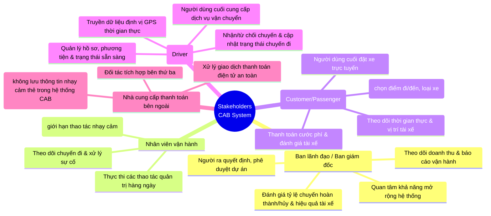

# TÀI LIỆU ĐẶC TẢ YÊU CẦU PHẦN MỀM (SRS)
## HỆ THỐNG ĐẶT XE TRỰC TUYẾN - CAB SYSTEM

---

## 1. Giới thiệu
### 1.1 Mục đích
Tài liệu này mô tả chi tiết các yêu cầu chức năng và phi chức năng cho nền tảng đặt xe trực tuyến (**CAB System**) của Công ty ABC, phục vụ cho đội ngũ phát triển, kiểm thử và ban quản lý dự án.

### 1.2 Phạm vi hệ thống
Hệ thống cung cấp giải pháp kết nối giữa khách hàng có nhu cầu di chuyển và tài xế, đồng thời cung cấp công cụ quản trị toàn diện cho nhân viên vận hành. Hệ thống hỗ trợ quy trình khép kín từ đặt xe, điều phối tự động, thực hiện chuyến đi, thanh toán, đến đánh giá và báo cáo.

---

## 2. Mô tả tổng quan
### 2.1 Các tác nhân (Actors)
* **Khách hàng:** Người sử dụng dịch vụ đặt xe, theo dõi chuyến đi, thanh toán và đánh giá.
* **Tài xế:** Người cung cấp dịch vụ vận chuyển, nhận chuyến, cập nhật trạng thái và vị trí GPS.
* **Nhân viên vận hành (Admin):** Quản lý tài khoản, theo dõi hệ thống, xử lý sự cố và xem báo cáo.
###2.2 Sơ đồ Statkhoder matrix
```mermaid
quadrantChart
    title Biểu đồ Phân tích Stakeholder (Power/Interest Grid)
    x-axis "Mức độ quan tâm thấp" --> "Mức độ quan tâm cao"
    y-axis "Mức độ ảnh hưởng thấp" --> "Mức độ ảnh hưởng cao"
    quadrant-1 "Giữ thông tin (Keep Informed)"
    quadrant-2 "Quản lý chặt chẽ (Manage Closely)"
    quadrant-3 "Giám sát (Monitor)"
    quadrant-4 "Giữ sự hài lòng (Keep Satisfied)"
    
    Ban lãnh đạo / Ban giám đốc: [0.85, 0.85]
    Nhân viên vận hành: [0.80, 0.55]
    Khách hàng (Customer / Passenger): [0.90, 0.25]
    Tài xế (Driver): [0.85, 0.20]
    Nhà cung cấp thanh toán: [0.20, 0.15]
```
### 2.2 Sơ đồ tổng quan hệ thống (Use Case / Context Diagram)
Dưới đây là sơ đồ Mermaid thể hiện tương tác giữa các tác nhân và hệ thống CAB:


###2.4 Bussiness godal
## Các Mục tiêu Kinh doanh (Business Goals) của Hệ thống CAB

* **Mở rộng quy mô và khả năng phục vụ (Scalability):** Xây dựng một nền tảng vận hành ổn định có khả năng đáp ứng lượng lớn khách hàng và tài xế đồng thời vào giờ cao điểm, đồng thời cho phép mở rộng linh hoạt các tính năng, loại dịch vụ mới và kênh thông báo trong tương lai mà không phải xây dựng lại toàn bộ hệ thống.
* **Tối ưu hóa hiệu quả điều phối và vận hành (Operational Efficiency):** Tự động hóa quy trình tìm kiếm và phân công tài xế dựa trên vị trí GPS, trạng thái sẵn sàng và các tiêu chí ưu tiên nhằm giảm thiểu thời gian chờ đợi của khách hàng và tối ưu hiệu suất hoạt động của tài xế.
* **Nâng cao trải nghiệm người dùng toàn diện (User Experience):** Cung cấp giao diện trực quan và quy trình liền mạch cho cả ba nhóm người dùng chính (khách hàng, tài xế, nhân viên vận hành) từ khâu đặt xe, theo dõi hành trình thời gian thực, thanh toán đến đánh giá chất lượng dịch vụ.
* **Đảm bảo an toàn tài chính và tuân thủ bảo mật (Security & Compliance):** Thiết lập hệ thống kiểm soát quyền hạn chặt chẽ, bảo vệ tuyệt đối dữ liệu cá nhân, thông tin vị trí và giao dịch, đồng thời tích hợp an toàn với cổng thanh toán bên thứ ba mà không lưu trữ thông tin nhạy cảm của thẻ.
* **Ra quyết định dựa trên dữ liệu (Data-Driven Insights):** Cung cấp hệ thống báo cáo và thống kê trực quan cho ban lãnh đạo về các chỉ số cốt lõi như số lượng chuyến đi, doanh thu, tỷ lệ hoàn thành, tỷ lệ hủy chuyến và hiệu quả hoạt động của tài xế để hỗ trợ việc hoạch định chiến lược kinh doanh.
## 3. Yêu cầu nghiệp vụ (Business Requirements)

### 3.1 Nhóm yêu cầu quản lý tài khoản & Xác thực (Authentication & User Management)
* **BR-ACC-01 (Đăng ký & Đăng nhập):** Hệ thống phải cho phép Khách hàng tự đăng ký tài khoản qua ứng dụng, trong khi tài khoản của Tài xế có thể được tạo trực tiếp bởi Tài xế hoặc do Nhân viên vận hành khởi tạo trên hệ thống quản trị.
* **BR-ACC-02 (Cập nhật hồ sơ):** Người dùng (Khách hàng và Tài xế) được phép cập nhật thông tin cá nhân; riêng tài xế cần có khả năng cập nhật thông tin phương tiện và chuyển đổi trạng thái hoạt động (sẵn sàng/ngừng nhận chuyến).
* **BR-ACC-03 (Phân quyền quản trị):** Hệ thống phải phân quyền nghiêm ngặt cho Nhân viên vận hành, giới hạn quyền truy cập vào các chức năng nhạy cảm để đảm bảo an toàn dữ liệu và tính toàn vẹn của hệ thống.

### 3.2 Nhóm yêu cầu điều phối & Đặt xe (Booking & Matching Dispatch)
* **BR-CAB-01 (Tạo yêu cầu đặt xe):** Khách hàng phải có khả năng nhập điểm đón, điểm đến, lựa chọn loại hình dịch vụ và gửi yêu cầu đặt xe lên hệ thống.
* **BR-CAB-02 (Thuật toán tự động tìm tài xế):** Hệ thống phải tự động xác định và đề xuất tài xế phù hợp dựa trên vị trí GPS thời gian thực, trạng thái sẵn sàng và các tiêu chí ưu tiên vận hành.
* **BR-CAB-03 (Cơ chế xử lý khi từ chối/quá hạn):** Nếu tài xế được đề xuất từ chối hoặc không phản hồi trong thời gian quy định (timeout), hệ thống phải tự động chuyển sang tìm kiếm tài xế tiếp theo mà không yêu cầu khách hàng phải thao tác tạo lại yêu cầu đặt xe. Trường hợp tuyệt đối không tìm được tài xế, hệ thống phải thông báo rõ ràng cho khách hàng.

### 3.3 Nhóm yêu cầu quản lý chuyến đi (Trip Management)
* **BR-TRIP-01 (Theo dõi trạng thái thời gian thực):** Khách hàng phải theo dõi được các mốc trạng thái: hệ thống đang tìm tài xế, tài xế đã nhận chuyến, thời gian dự kiến tài xế đến, và trạng thái di chuyển hiện tại.
* **BR-TRIP-02 (Cập nhật mốc hành trình):** Tài xế bắt buộc phải cập nhật đầy đủ các trạng thái trong suốt chuyến đi bao gồm: đã đến điểm đón, đã đón khách, đang di chuyển và hoàn thành chuyến đi.
* **BR-TRIP-03 (Lịch sử & Đánh giá):** Sau khi hoàn thành chuyến đi, hệ thống phải lưu trữ lịch sử chuyến đi, tính toán số tiền khách hàng phải trả và cho phép khách hàng đánh giá chất lượng tài xế.

### 3.4 Nhóm yêu cầu thanh toán & Cước phí (Billing & Payment)
* **BR-PAY-01 (Tính cước tự động):** Hệ thống phải tự động tính toán tổng số tiền cước mà khách hàng phải trả dựa trên loại dịch vụ và các thông số thực tế của chuyến đi.
* **BR-PAY-02 (Phương thức thanh toán linh hoạt):** Hỗ trợ hình thức thanh toán bằng tiền mặt hoặc qua cổng thanh toán điện tử tích hợp từ bên thứ ba.

### 3.5 Nhóm yêu cầu thông báo (Notification System)
* **BR-NOT-01 (Thông báo đa chiều):** Hệ thống phải gửi thông báo tự động cho Khách hàng (khi tiếp nhận yêu cầu, có tài xế nhận, tài xế đến, hoàn thành chuyến, kết quả thanh toán) và cho Tài xế (khi có chuyến mới hoặc thay đổi liên quan).
* **BR-NOT-02 (Mở rộng kênh thông báo):** Kiến trúc phân hệ thông báo phải được thiết kế linh hoạt, cho phép dễ dàng tích hợp thêm các kênh truyền tải mới (như SMS, Push Notification, Zalo ZNS, Email...) trong tương lai mà không làm ảnh hưởng đến cấu trúc toàn hệ thống.

### 3.6 Nhóm yêu cầu quản trị & Báo cáo (Operations & Reporting)
* **BR-OPS-01 (Giao diện quản trị tập trung):** Cung cấp giao diện dashboard cho Nhân viên vận hành để quản lý hồ sơ (khách hàng, tài xế, phương tiện), giám sát các chuyến đi đang hoạt động theo thời gian thực và hỗ trợ xử lý sự cố phát sinh.
* **BR-OPS-02 (Hệ thống báo cáo kinh doanh):** Cung cấp các báo cáo tổng hợp dành cho Ban lãnh đạo bao gồm: số lượng chuyến đi, tổng doanh thu, tỷ lệ hoàn thành chuyến, tỷ lệ hủy chuyến và chỉ số đánh giá hiệu quả hoạt động của đội ngũ tài xế.

