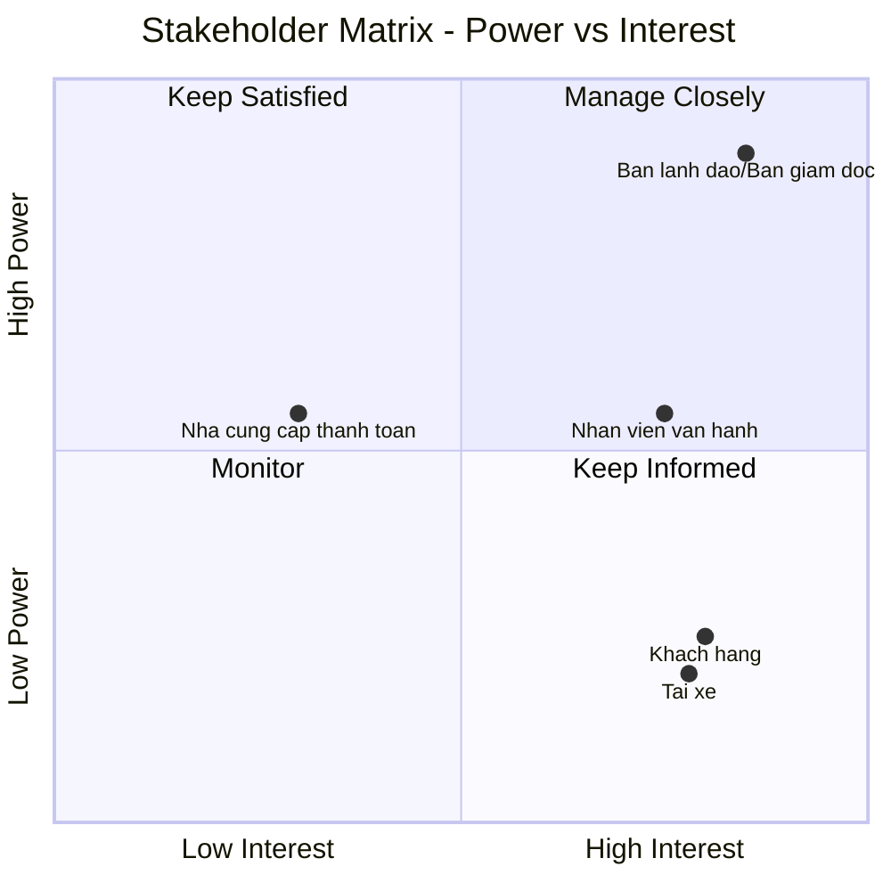
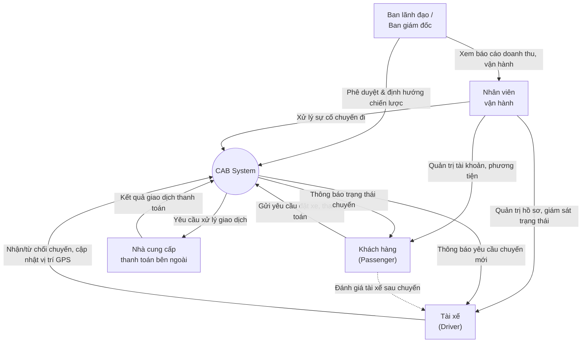
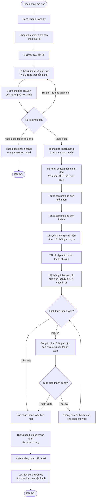
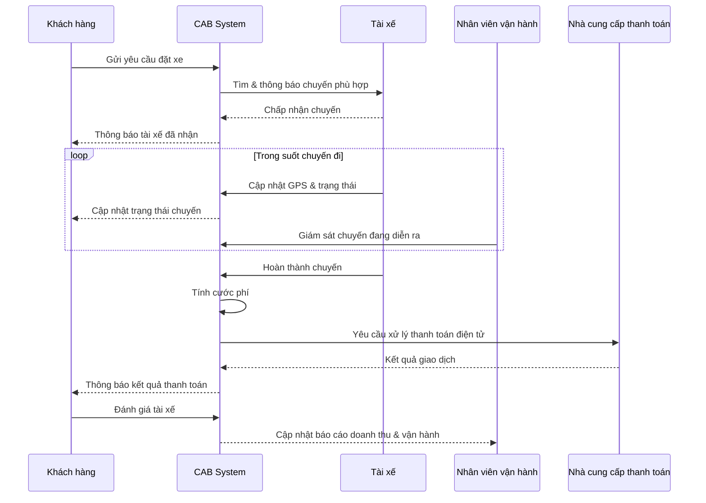

# CAB System – Phân tích Stakeholder & Business Requirement

> Dự án: Xây dựng nền tảng đặt xe trực tuyến CAB System — Công ty ABC

---

## 1. Stakeholder Matrix (Power – Interest Grid)

| Stakeholder | Power (Quyền lực/Ảnh hưởng) | Interest (Mức độ quan tâm) | Chiến lược quản lý | Vai trò chính |
|---|---|---|---|---|
| Ban lãnh đạo / Ban giám đốc | Cao | Cao | **Manage Closely** – quản lý sát sao | Ra quyết định, phê duyệt dự án, theo dõi doanh thu & hiệu quả vận hành |
| Nhân viên vận hành | Trung bình | Cao | **Keep Informed / Involve** – giữ liên hệ chặt | Thực thi thao tác quản trị hàng ngày, xử lý sự cố |
| Khách hàng (Customer/Passenger) | Thấp | Cao | **Keep Informed** – thông tin đầy đủ, thường xuyên | Người dùng cuối đặt xe, trải nghiệm dịch vụ |
| Tài xế (Driver) | Thấp | Cao | **Keep Informed** – thông tin đầy đủ, thường xuyên | Người dùng cuối cung cấp dịch vụ vận chuyển |
| Nhà cung cấp thanh toán bên ngoài | Trung bình | Thấp | **Keep Satisfied** – đảm bảo hài lòng, tuân thủ hợp đồng/bảo mật | Đối tác xử lý giao dịch thanh toán điện tử |

### Biểu đồ ma trận (Mermaid Quadrant Chart)

---

## 2. Sơ đồ quan hệ giữa các Stakeholder

**Ghi chú quan hệ:**
- **Ban lãnh đạo → Nhân viên vận hành**: giao chỉ tiêu, nhận báo cáo.
- **Nhân viên vận hành ↔ Khách hàng/Tài xế**: giám sát, hỗ trợ, xử lý sự cố, phân quyền thao tác nhạy cảm.
- **Khách hàng ↔ Tài xế**: kết nối qua hệ thống (matching), tương tác đánh giá sau chuyến.
- **CAB System ↔ Nhà cung cấp thanh toán**: tích hợp bên thứ ba, không lưu thông tin thẻ nhạy cảm trong hệ thống CAB.

---

## 3. Business Goals

| # | Business Goal |
|---|---|
| BG1 | Xây dựng nền tảng đặt xe hiện đại thay thế mô hình tổng đài/ứng dụng thủ công hiện tại |
| BG2 | Tự động hóa việc phân công/tìm tài xế, giảm thao tác thủ công |
| BG3 | Tăng khả năng mở rộng để phục vụ số lượng lớn khách hàng và tài xế, đồng thời dễ dàng bổ sung tính năng trong tương lai |
| BG4 | Tăng tính minh bạch cho khách hàng: theo dõi chuyến đi và vị trí tài xế theo thời gian thực |
| BG5 | Quản lý và xử lý thanh toán tập trung, an toàn, không lưu thông tin nhạy cảm của thẻ trong hệ thống |
| BG6 | Cung cấp công cụ báo cáo và ra quyết định cho Ban lãnh đạo (doanh thu, tỷ lệ hoàn thành/hủy chuyến, hiệu quả tài xế) |
| BG7 | Đảm bảo hệ thống vận hành ổn định, chịu tải cao trong giờ cao điểm, có khả năng mở rộng độc lập theo từng thành phần |
| BG8 | Đảm bảo an toàn thông tin: xác thực, phân quyền, bảo vệ dữ liệu cá nhân/vị trí/giao dịch, lưu vết thao tác quan trọng |

---

## 4. Business Requirements

### 4.1 Nhóm Khách hàng (Customer)
- **BR-01**: Đăng ký tài khoản, đăng nhập, cập nhật thông tin cá nhân
- **BR-02**: Nhập điểm đón/điểm đến, chọn loại xe, gửi yêu cầu đặt xe
- **BR-03**: Theo dõi trạng thái chuyến đi theo thời gian thực (đang tìm tài xế, tài xế đã nhận, thời gian dự kiến đến, trạng thái hiện tại)
- **BR-04**: Xem lịch sử chuyến đi, số tiền đã thanh toán
- **BR-05**: Đánh giá tài xế sau khi hoàn thành chuyến
- **BR-06**: Nhận thông báo theo các mốc quan trọng của chuyến (tiếp nhận yêu cầu, tài xế nhận chuyến, tài xế đến điểm đón, hoàn thành chuyến, kết quả thanh toán)

### 4.2 Nhóm Tài xế (Driver)
- **BR-07**: Đăng ký tài khoản hoặc được nhân viên vận hành tạo tài khoản
- **BR-08**: Cập nhật hồ sơ cá nhân, thông tin phương tiện, trạng thái hoạt động (sẵn sàng nhận chuyến)
- **BR-09**: Nhận thông báo chuyến phù hợp; chấp nhận hoặc từ chối chuyến
- **BR-10**: Cập nhật trạng thái chuyến (đã đến điểm đón, đã đón khách, đang di chuyển, hoàn thành)
- **BR-11**: Truyền dữ liệu vị trí GPS theo thời gian thực

### 4.3 Nhóm Tìm & phân công tài xế (Matching)
- **BR-12**: Xác định danh sách tài xế phù hợp dựa trên vị trí, trạng thái sẵn sàng và tiêu chí vận hành
- **BR-13**: Ưu tiên tài xế phù hợp/gần khách hàng nhất
- **BR-14**: Xử lý trường hợp tài xế không phản hồi hoặc từ chối — tự động tìm tài xế khác mà không cần khách hàng tạo lại yêu cầu
- **BR-15**: Thông báo rõ ràng cho khách hàng khi không tìm được tài xế phù hợp

### 4.4 Nhóm Thanh toán (Payment)
- **BR-16**: Tính cước phí dựa trên loại dịch vụ và thông tin chuyến đi
- **BR-17**: Hỗ trợ thanh toán bằng tiền mặt và thanh toán điện tử
- **BR-18**: Tích hợp với nhà cung cấp thanh toán bên ngoài; không lưu thông tin thẻ/tài khoản thanh toán nhạy cảm trong hệ thống CAB
- **BR-19**: Xử lý và thông báo khi giao dịch thanh toán điện tử thất bại, cho phép xử lý lại theo chính sách doanh nghiệp

### 4.5 Nhóm Thông báo (Notification)
- **BR-20**: Gửi thông báo đa kênh cho khách hàng và tài xế theo các sự kiện của chuyến đi
- **BR-21**: Kiến trúc cho phép mở rộng thêm kênh thông báo mới trong tương lai mà không ảnh hưởng toàn hệ thống

### 4.6 Nhóm Quản trị vận hành (Admin/Operations)
- **BR-22**: Giao diện quản trị để quản lý khách hàng, tài xế, phương tiện, chuyến đi
- **BR-23**: Xem chuyến đang diễn ra, kiểm tra trạng thái tài xế, hỗ trợ xử lý chuyến bị lỗi
- **BR-24**: Tra cứu lịch sử giao dịch
- **BR-25**: Phân quyền truy cập — giới hạn thao tác nhạy cảm cho nhân viên thông thường
- **BR-26**: Báo cáo số lượng chuyến, doanh thu, tỷ lệ hoàn thành/hủy chuyến, hiệu quả hoạt động tài xế

### 4.7 Yêu cầu phi chức năng (Non-functional Requirements)
- **BR-27**: Hệ thống ổn định trong thời điểm nhu cầu tăng cao (khả năng chịu tải)
- **BR-28**: Lỗi ở một thành phần (thanh toán, thông báo) không được làm ngừng toàn bộ hệ thống đặt xe (fault isolation)
- **BR-29**: Các thành phần có khả năng mở rộng (scale) độc lập
- **BR-30**: Hỗ trợ triển khai tính năng mới từng phần, hạn chế ảnh hưởng chức năng đang hoạt động

### 4.8 Yêu cầu bảo mật (Security)
- **BR-31**: Xác thực khách hàng và tài xế trước khi sử dụng chức năng cần tài khoản
- **BR-32**: Kiểm soát quyền truy cập cho các thao tác quản trị
- **BR-33**: Bảo vệ thông tin cá nhân, thông tin phương tiện, dữ liệu vị trí, dữ liệu giao dịch
- **BR-34**: Lưu vết (audit log) các thao tác quan trọng phục vụ kiểm tra sự cố

### 4.9 Các vấn đề cần làm rõ thêm (Open Issues / TBD)
- Cách tính cước cụ thể
- Tiêu chí ưu tiên tài xế chi tiết
- Thời gian tối đa tài xế phải phản hồi yêu cầu
- Chính sách hủy chuyến
- Cách xử lý khi mất kết nối mạng
- Thời gian lưu trữ dữ liệu

---

## 5. Mô hình Quy trình Nghiệp vụ (Business Process Model)

### Quy trình hỗ trợ song song (Operations/Admin)

---

*Lưu ý: Toàn bộ sơ đồ Mermaid trong tài liệu này render trực tiếp khi xem trên GitHub (README.md, Wiki, hoặc file .md trong repository).*
