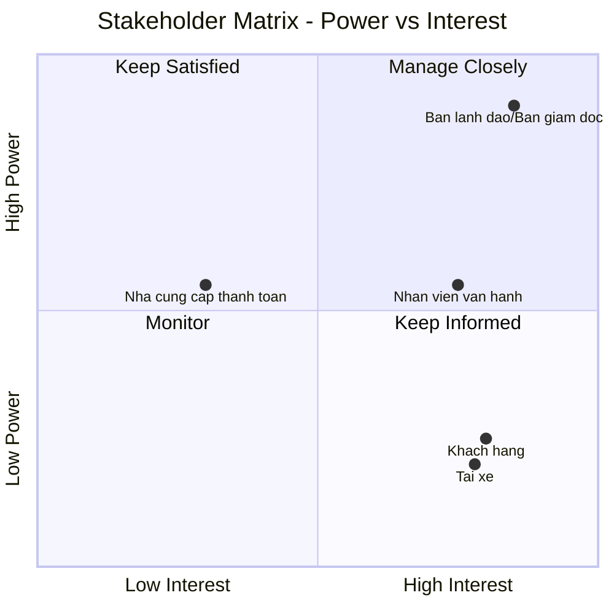
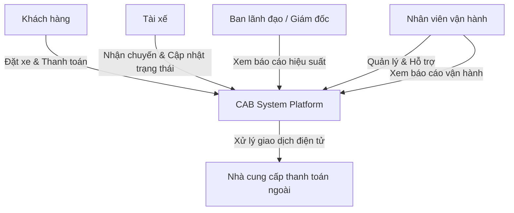
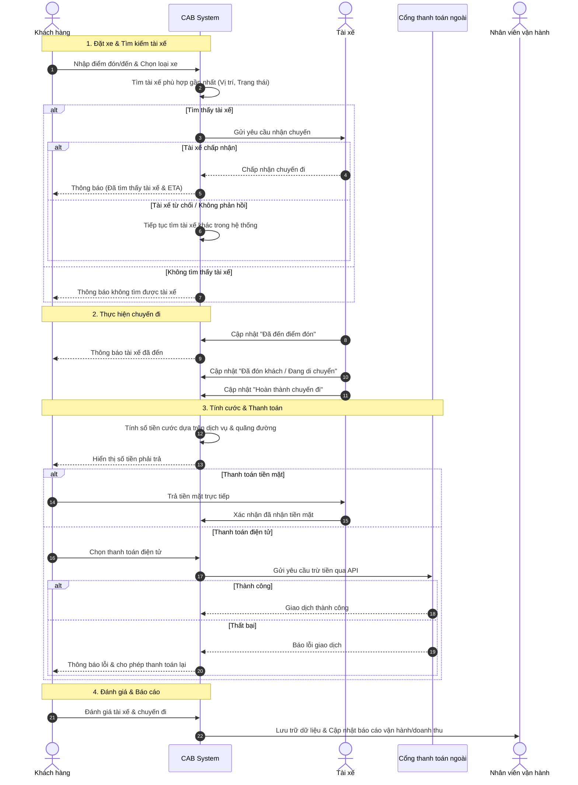

Dưới đây là tài liệu phân tích hệ thống **CAB System (Nền tảng đặt xe)** được trình bày hoàn toàn bằng định dạng Markdown của GitHub, bao gồm sơ đồ Stakeholder Matrix, sơ đồ quan hệ Stakeholder, Mục tiêu kinh doanh (Business Goals), Yêu cầu kinh doanh (Business Requirements) và Mô hình quy trình nghiệp vụ được vẽ bằng mã **Mermaid**.

---

# BÁO CÁO PHÂN TÍCH HỆ THỐNG: CAB SYSTEM

## 1. Stakeholder Matrix (Power – Interest Grid)

| Stakeholder | Power (Quyền lực/Ảnh hưởng) | Interest (Mức độ quan tâm) | Vai trò chính |
|---|---|---|---|
| Ban lãnh đạo / Ban giám đốc | Cao | Cao |  Ra quyết định, phê duyệt dự án, theo dõi doanh thu & hiệu quả vận hành |
| Nhân viên vận hành | Trung bình | Cao |  Thực thi thao tác quản trị hàng ngày, xử lý sự cố |
| Khách hàng (Customer/Passenger) | Thấp | Cao | Người dùng cuối đặt xe, trải nghiệm dịch vụ |
| Tài xế (Driver) | Thấp | Cao | Người dùng cuối cung cấp dịch vụ vận chuyển |
| Nhà cung cấp thanh toán bên ngoài | Trung bình | Thấp | Đối tác xử lý giao dịch thanh toán điện tử |

### Biểu đồ ma trận (Mermaid Quadrant Chart)

## 3. Sơ đồ Quan hệ giữa các Stakeholder (Stakeholder Relationship Diagram)

Sơ đồ Mermaid thể hiện mối quan hệ và sự tương tác giữa các bên liên quan trong hệ sinh thái CAB System:

---

## 4. Mục tiêu Kinh doanh (Business Goals)

Dựa trên yêu cầu của Công ty ABC, các mục tiêu chiến lược của hệ thống CAB System gồm:

1. **Mở rộng quy mô phục vụ:** Xây dựng nền tảng mới có khả năng phục vụ số lượng lớn khách hàng và tài xế đồng thời, khắc phục tình trạng phân công thủ công hiện tại.

2. **Tối ưu hóa quy trình vận hành:** Tự động hóa khâu tìm kiếm và phân phối tài xế dựa trên vị trí, trạng thái sẵn sàng, giảm thiểu can thiệp thủ công của nhân viên.

3. **Minh bạch hóa trải nghiệm người dùng:** Cho phép khách hàng theo dõi thời gian thực trạng thái chuyến đi, định vị tài xế, xem lịch sử và đánh giá minh bạch.

4. **Đảm bảo an toàn thanh toán:** Tích hợp cổng thanh toán bên ngoài để xử lý giao dịch điện tử và tiền mặt linh hoạt mà không lưu trữ thông tin thẻ nhạy cảm.

5. **Kiến trúc linh hoạt, dễ mở rộng:** Hỗ trợ mở rộng độc lập các thành phần (thanh toán, thông báo, dịch vụ mới) khi tải tăng cao hoặc khi thay đổi nghiệp vụ trong tương lai.

## 5. Yêu cầu Kinh doanh (Business Requirements)

### 5.1. Yêu cầu Chức năng (Functional Requirements)

* **Quản lý tài khoản & Xác thực:** Hỗ trợ đăng ký, đăng nhập, phân quyền cho Khách hàng, Tài xế và Nhân viên vận hành.

* **Đặt xe & Tìm tài xế:** Khách hàng nhập điểm đi/đến, chọn loại xe; hệ thống tự động thuật toán tìm tài xế gần nhất, có cơ chế chuyển tiếp nếu tài xế từ chối/không phản hồi.

* **Quản lý chuyến đi:** Tài xế cập nhật các mốc trạng thái (đến điểm đón, đón khách, đang di chuyển, hoàn thành); lưu vết vị trí tài xế.

* **Tính cước & Thanh toán:** Tự động tính cước dựa trên loại dịch vụ và thông tin chuyến đi; hỗ trợ tiền mặt và thanh toán điện tử qua bên thứ ba.

* **Hệ thống thông báo:** Gửi thông báo đa kênh (trạng thái đặt xe, tài xế đến, hoàn thành, kết quả thanh toán) cho cả khách hàng và tài xế.

* **Quản trị & Báo cáo:** Giao diện cho nhân viên vận hành quản lý dữ liệu và xử lý sự cố; cung cấp báo cáo doanh thu, tỷ lệ hoàn thành/hủy chuyến cho ban lãnh đạo.

### 5.2. Yêu cầu Phi Chức năng (Non-Functional Requirements)

* **Hiệu năng & Khả năng mở rộng:** Hệ thống ổn định vào giờ cao điểm; các thành phần có thể mở rộng độc lập khi tải tăng.

* **Bảo mật:** Xác thực chặt chẽ, kiểm soát quyền truy cập trang quản trị; bảo vệ dữ liệu cá nhân, vị trí, giao dịch và lưu vết (audit log) các thao tác quan trọng.

* **Tính linh hoạt kiến trúc:** Cho phép triển khai từng phần tính năng mới mà không làm gián đoạn các dịch vụ đang hoạt động.

---

## 6. Mô hình Quy trình Nghiệp vụ (Business Process Model)

Sơ đồ Mermaid dưới đây mô tả toàn bộ vòng đời quy trình nghiệp vụ của một chuyến đi trên hệ thống CAB System (từ lúc đặt xe đến khi đánh giá):

### 7 Phân tích chức năng nghiệp vụ

Dựa trên sơ đồ, hệ thống có thể phân rã thành 4 nhóm chức năng nghiệp vụ chính (module), mỗi nhóm gồm các chức năng con (use case) cụ thể.

1. Module Đặt xe & Điều phối tài xế (Booking & Dispatch)

Chức năng nghiệp vụ:

F1.1 – Đặt chuyến đi: Khách hàng nhập điểm đón, điểm đến, chọn loại dịch vụ xe (car/bike/premium...)
F1.2 – Tìm kiếm tài xế phù hợp: Hệ thống dựa trên vị trí GPS và trạng thái (rảnh/bận) để lọc danh sách tài xế gần nhất
F1.3 – Gửi yêu cầu chuyến đi tới tài xế: Push notification/thông báo yêu cầu nhận chuyến
F1.4 – Xử lý phản hồi tài xế: Ghi nhận Chấp nhận / Từ chối / Timeout không phản hồi
F1.5 – Vòng lặp tìm tài xế thay thế: Nếu bị từ chối, tự động chuyển yêu cầu sang tài xế tiếp theo trong danh sách
F1.6 – Thông báo kết quả đặt xe cho khách: Báo tìm thấy tài xế kèm ETA (thời gian dự kiến đến), hoặc báo không tìm được tài xế

Đối tượng nghiệp vụ liên quan: Driver Pool, Trip Request, Location Tracking, Vehicle Type/Service Type.

2. Module Quản lý hành trình (Trip Execution / Trip Lifecycle)

Chức năng nghiệp vụ:

F2.1 – Cập nhật trạng thái "Tài xế đã đến điểm đón"
F2.2 – Thông báo real-time cho khách hàng khi trạng thái chuyến đi thay đổi
F2.3 – Cập nhật trạng thái "Đã đón khách / Đang di chuyển"
F2.4 – Cập nhật trạng thái "Hoàn thành chuyến đi"

Ghi chú nghiệp vụ: Đây thực chất là một State Machine của chuyến đi (Trip Status): Requested → Accepted → Driver Arrived → In Progress → Completed. Có thể bổ sung thêm trạng thái Cancelled (hủy chuyến) mà sơ đồ hiện chưa mô tả — đây là điểm cần làm rõ thêm khi phân tích đầy đủ.

3. Module Tính cước & Thanh toán (Fare Calculation & Payment)

Chức năng nghiệp vụ:

F3.1 – Tính cước phí: Dựa trên loại dịch vụ, quãng đường, có thể có thêm thời gian di chuyển, phụ phí giờ cao điểm (chưa thấy mô tả trong sơ đồ)
F3.2 – Hiển thị số tiền cần thanh toán cho khách hàng
F3.3 – Thanh toán tiền mặt (Cash):
Khách trả trực tiếp cho tài xế
Tài xế xác nhận đã nhận tiền vào hệ thống
F3.4 – Thanh toán điện tử (E-payment):
Khách chọn hình thức thanh toán điện tử
Gọi API tới cổng thanh toán bên thứ 3
Xử lý kết quả: Thành công → xác nhận giao dịch; Thất bại → báo lỗi và cho phép thanh toán lại (retry)

Đối tượng nghiệp vụ liên quan: Fare Engine, Payment Gateway Integration, Transaction Log.

Điểm cần lưu ý khi phân tích sâu hơn: Sơ đồ chưa thể hiện: xử lý hoàn tiền (refund), xử lý khi khách không thanh toán được nhiều lần, hay cơ chế đối soát (reconciliation) với cổng thanh toán.

4. Module Đánh giá & Báo cáo vận hành (Rating & Reporting)

Chức năng nghiệp vụ:

F4.1 – Đánh giá tài xế/chuyến đi: Khách hàng chấm điểm, nhận xét sau khi kết thúc chuyến
F4.2 – Lưu trữ dữ liệu chuyến đi: Ghi nhận toàn bộ vòng đời chuyến đi vào hệ thống
F4.3 – Cập nhật báo cáo vận hành/doanh thu: Tổng hợp dữ liệu phục vụ nhân viên vận hành (revenue report, driver performance report...)
